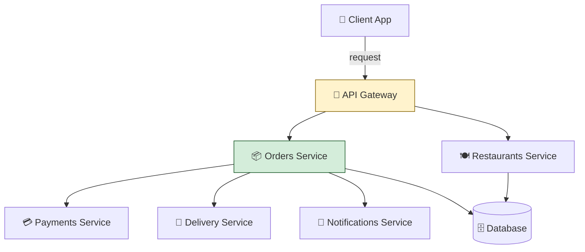

# The Friday Night Problem

It's 7:42 PM on a Friday. You open your food delivery app. You're hungry, you're tired, and you want pad thai from that place on 9th Street — the one that's usually great but always forgets the lime.

You tap. You wait. The little spinner spins. You wait more. Then, finally: *restaurant unavailable*.

You try another place. Same spinner. Same outcome. You switch apps. Spinner. Spinner. Spinner. You give up, walk to the corner store, and buy a sad sandwich.

What just happened?

The restaurant wasn't closed. The app wasn't broken. What broke was the **system** behind the app — the collection of services, databases, queues, and external integrations that together make "tap a button, food arrives" possible. On a normal Tuesday at 2 PM, that system purrs. On a Friday at 7:42 PM, when everyone in your city is opening the app at the same time, it falls over.

This is the **Friday Night Problem**. And it's the entire reason system design exists as a discipline.

---

## Remember — name it

**System design** is the practice of deciding how to split a piece of software into parts, how those parts talk to each other, and how the whole thing survives when the world gets hard.

That's it. That's the term. Hold onto it.

A few more words you'll need, each with a one-line anchor:

- **Service** — a piece of software that does one job and does it well. Like a kitchen station: the grill cook does grill things, the salad cook does salad things.
- **Request / Response** — a single round trip. You ask, it answers. "Is the pad thai available?" / "Yes." That's one request-response pair.
- **Latency** — how long a single request takes, start to finish. Fast latency feels instant. Slow latency feels like the Friday night spinner.
- **Throughput** — how many requests the system can handle at once. One chef has low throughput. Twenty chefs have high throughput.
- **Scale** — the size of the load the system is built for. A system designed for 100 simultaneous users will die at 100,000, even if the code is perfect.

We'll come back to all of these. For now, just notice: they're all about *how the system behaves under load*, not about whether the code is correct.

---

## Understand — explain it in plain words

Here's the part most beginners miss.

When you write a small program — a script that reads a file, transforms it, writes it back — your code's correctness is the whole story. If the script works on your laptop, it works. Done.

When you write software that serves a million people at once, correctness is the *floor*, not the ceiling. The script being right doesn't tell you:

- What happens when 10,000 people hit "place order" in the same second?
- What happens when the payment processor takes 3 seconds to respond instead of 200 milliseconds?
- What happens when the recommendation service crashes — does the whole app crash, or does the user still see a working homepage with recommendations just missing?
- What happens when a database write fails halfway through — did the order go through, or didn't it?
- What happens when the CEO says "we're launching in three new countries next month" — does the system grow with that, or does it need a rewrite?

**System design is the answer to those questions.** It's the discipline of asking, *before you write the code*: how will this behave when it's big, when it's stressed, when pieces of it fail, when it has to change?

A good system designer doesn't ask "will this work?" They ask "what will this do when it stops working?" — because everything stops working eventually. The question is whether it stops working *gracefully*.

### The four questions every system design answers

Strip away the jargon and every system design — from a food delivery app to a multi-billion-parameter LLM training cluster — is answering the same four questions:

1. **What are the parts, and what does each one do?** (Decomposition.)
2. **How do the parts talk to each other?** (Communication.)
3. **What happens when a part fails or slows down?** (Resilience.)
4. **What happens when load grows or shrinks?** (Scaling.)

If you can answer those four questions for any system, you understand its design. If you can't, you don't — no matter how many diagrams you've memorized.

---

## Apply — use it on a toy example

Let's design the food delivery app. Not the AI parts — just the boring skeleton. We want to see system design thinking happen in real time.

**The parts:**

- A **client app** (the thing on your phone).
- An **API gateway** (the front door — receives your requests, routes them).
- An **orders service** (handles "place order," "where's my order," "cancel order").
- A **restaurants service** (handles "is this restaurant available," "what's on the menu").
- A **payments service** (talks to Stripe, marks the order as paid).
- A **delivery service** (assigns drivers, tracks them on the map).
- A **notifications service** (sends you "your driver is on the way" SMS).

Each of these is a *service*. Each one does one job. None of them knows the full story — they each know their piece, and they talk to each other to make the whole thing work.

**How they talk:** the client app talks to the API gateway. The API gateway talks to whichever service the request is for. Services talk to each other when they need to — the orders service asks the payments service "did this pay?", then asks the delivery service "find me a driver."

**What happens when a part fails:** if the recommendations service dies (we don't have one in this toy example, but imagine we did), the app should *still work* — the user just doesn't get recommendations. If the payments service dies, the user can still browse, but can't place orders. If the orders service dies, the whole app is dead, because every interesting action routes through it.

Notice the asymmetry. Not all services are equal. Some failures are graceful degradations. Some failures take the whole system down. System design is the act of *deciding which is which, on purpose, in advance*.

**What happens when load grows:** on a Tuesday at 2 PM, one orders service instance handles all the traffic. On a Friday at 7:42 PM, you spin up ten instances of the orders service, put a *load balancer* in front of them, and distribute traffic across all ten. The code didn't change — the *topology* changed. That's scaling.

Here's the picture:

That's a system design diagram. Boxes are services. Arrows are "talks to." Cylinders are data stores. The API gateway is highlighted because it's the chokepoint — everything goes through it. The orders service is highlighted because it's the brain — most interesting logic lives there.

If you can read this diagram, you can read most system design diagrams. They're all variations on this theme.

---

## Analyze — where it breaks

Now the interesting part. Where does our food delivery design break?

**The API gateway is a single point of failure.** If it dies, the whole app dies. Even though we have ten copies of the orders service, they're all unreachable if the gateway is down. *Fix:* run multiple gateway instances behind DNS round-robin or a CDN's edge layer. Cost: complexity. Benefit: resilience.

**The orders service is overloaded.** It's doing too much — placing orders, checking status, cancelling, refunding. As the company grows, every team wants to add features to it. It becomes a *god object*. *Fix:* split it. Orders-placement service, order-status service, refunds service. Cost: more services to operate, more cross-service calls. Benefit: each can scale and fail independently.

**The database is shared.** Every service reads and writes the same database. That means a slow query in the restaurants service can starve the orders service. *Fix:* give each service its own database. Cost: data synchronization becomes a problem (what if restaurants and orders need to know the same thing?). Benefit: isolation.

**The payments service is synchronous.** When you place an order, the orders service *waits* for the payments service to confirm before proceeding. If Stripe is slow, your order is slow. *Fix:* make payments asynchronous — return immediately, process in the background, notify when done. Cost: the user doesn't know immediately whether their card was charged. Benefit: the orders flow is no longer coupled to Stripe's latency.

Notice what's happening here. Every fix is a *tradeoff*. We're not eliminating problems; we're choosing which problems to have. That's the central act of system design.

A bad system designer optimizes one thing until everything else breaks. A good system designer holds the whole field of tradeoffs in mind and picks the combination that hurts least for *this specific product, at this specific scale, with these specific users*.

---

## Evaluate — judge a tradeoff

Let's make this concrete. Real decision a real team had to make.

**The scenario:** You're shipping a new feature — "live order tracking on a map." Every second, the client app needs to know where the driver is. Two designs:

**Design A — Polling.** The client app asks the delivery service "where's my driver?" every 2 seconds. The delivery service queries its database and returns the latest position.

**Design B — WebSockets.** The client opens a long-lived connection to the delivery service. Whenever the driver's position updates, the delivery service pushes the new position down the open connection.

Which is better?

*Design A is simpler.* No special infrastructure. Works through any firewall. Easy to debug — each request is independent.

*Design A is more expensive at scale.* If you have a million concurrent orders, that's 500,000 requests per second hitting your delivery service, just to ask "where's my driver?" Most of those answers will be "same place as 2 seconds ago." You're burning database queries to return unchanged data.

*Design B is more efficient at scale.* One connection per order. Updates only when something changes. Far less wasted work.

*Design B is harder to operate.* WebSocket connections break when networks switch (cellular → WiFi). You need a sticky-session load balancer. You need to handle reconnection logic. You need to monitor connection counts as a capacity metric.

**The verdict depends on your scale and your team.** If you have 1,000 concurrent users and a small team, Design A wins — the simplicity is worth the inefficiency. If you have 1,000,000 concurrent users, Design A will literally melt your servers, and Design B's complexity becomes the cheaper option.

There is no universally correct answer. There's only the right answer *for your situation* — and a good system designer can articulate both the question and the tradeoff in the same breath.

---

## Create — design something new

Here's your turn. Don't worry about getting it "right" — system design is a craft, not a test.

**Design a system for a tiny online bookstore.** The store has:

- 10,000 books in its catalog.
- 100 visitors browsing at any given time.
- 5–10 orders per day.

Sketch the parts. Sketch how they talk. Sketch what fails when one part dies. Sketch what you'd change if traffic grew 100x.

Spend ten minutes on this. Draw it on paper if you can — system design is a kinesthetic skill, and the act of drawing matters.

Some questions to prompt your thinking:

- Does the catalog (the list of books) need its own service, or can it just live in the database?
- When a user places an order, do you synchronously charge their card, or do you process payment asynchronously?
- If the database dies, can users still browse? Can they still place orders?
- What happens if two users try to buy the last copy of a book at the same time?

You don't need to answer all of these. You need to *notice* that they're questions. That's the beginning of system design thinking — the moment you stop asking "does this work?" and start asking "what does this do when it stops working?"

---

## A common misconception

**"System design is just drawing boxes and arrows."**

It looks like that, on the surface. The diagrams are full of boxes and arrows. The interviews are full of diagrams. The blog posts are full of diagrams.

But the boxes and arrows are the *output* of system design, not the *act* of it. The act of system design is **making tradeoffs under constraints**. The diagram is the artifact that captures those decisions so other people can reason about them.

Two people can draw the same diagram. One of them understands *why each box is there, what failure each arrow implies, what would change if the load doubled*. The other is just drawing shapes they saw in a tutorial.

The way you tell the difference: ask "why is this a separate service?" about any box. A real system designer has an answer. A box-drawer says "that's how the diagram I copied did it."

---

## Explain it back

Close the laptop. Close the tab. In your own words, out loud, as if to a curious friend who's never heard of any of this:

> "System design is the practice of _____. The four questions every system design answers are _____, _____, _____, and _____. The reason it matters is that _____."

Don't peek at this chapter. If you can fill those blanks in your own words — not the exact words I used, but your own — you understand it. If you can't, go back and read the "Understand" section again. The goal isn't to memorize the definition; the goal is to *own* the concept well enough that you could explain it to someone who's never heard it.

That's the test. Not a quiz. Not a multiple-choice question. Whether you can teach it back.

---

## Go deeper

For the staff-level reference version of system design fundamentals — capacity estimation, the actual numbers behind latency budgets, the formal frameworks — graduate to [ai-system-design-guide § System Design Basics](https://github.com/ombharatiya/ai-system-design-guide#system-design-basics). It assumes you already have the vocabulary this chapter just gave you.

When you're ready, [Module 0.1 — Why AI Breaks Differently](./0.1-why-ai-breaks-differently.md) takes everything we just learned and asks: *why does AI make all of this harder?* The food delivery app was hard. AI systems are harder. The next chapter explains why — and sets up the entire rest of the curriculum.
