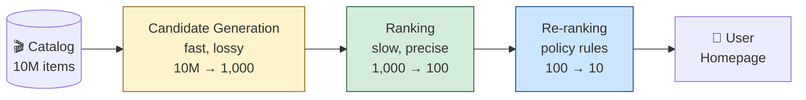

# The Front Page Mind Reader

You open Netflix. Or Spotify. Or YouTube. Or that e-commerce app you can't quit. Before you've typed a single letter, the homepage is full of stuff. Shows you might like. Songs queued up. Products picked "for you."

How?

It's not magic and it's not one model. It's a system — and the system has a shape. A specific, learnable, surprisingly consistent shape that every recommendation system from Netflix to Spotify to Amazon follows, with variations.

This chapter is about that shape. By the end, you should be able to whiteboard a recommendation system, explain why it has the parts it has, and spot the design decisions hiding inside any "for you" feed you encounter.

But first, a story.

---

## The story

Picture a video store. The kind that used to exist on every corner before streaming ate them. You walk in on a Friday night. 10,000 movies on the shelves. You have thirty minutes before your pizza arrives.

The clerk behind the counter — let's call her Maya — has watched you come in for years. She knows you. She knows you love heist movies, can't stand rom-coms, will watch anything with a car chase, and once stayed up until 3 AM finishing that one Spanish thriller she recommended.

You walk up. "What should I watch?"

Maya doesn't pull one movie off the shelf. That would be insane — you might not be in the mood. She pulls *ten*. "These just came in. This one's a heist movie. This one's got a great car chase. This one's the Spanish director you liked. Pick whichever."

You browse the ten. You pick one. You leave happy.

That two-step — *pick ten candidates fast, then rank them carefully* — is the entire shape of a recommendation system. We just gave it a name: **candidate generation** followed by **ranking**. Every other detail is variation on the theme.

Why two steps? Why not just rank all 10,000 movies directly?

Because ranking 10,000 movies *carefully* would take Maya an hour. You'd be standing at the counter forever. Instead, she uses a fast, cheap, *lossy* method to get from 10,000 down to 10 — "anything with a car chase or a heist or that Spanish director." Then she uses a slow, expensive, *precise* method to put those 10 in order.

The art of recommendation system design is: **what's the cheap method, what's the expensive method, and where do you draw the line?**

---

## Remember — name it

Before we go further, the words.

- **Candidate generation** — the first stage. Cheap, fast, lossy. Reduces millions of items down to hundreds or thousands. "Pull everything that might be relevant."
- **Ranking** — the second stage. Expensive, slow, precise. Orders the candidates and picks the top few to actually show. "Of the things we pulled, which ones are best?"
- **Re-ranking** — sometimes a third stage. Applies final business rules: deduplication, diversity, freshness, "don't show two ads in a row." "Final polish before serving."
- **Cold start** — the problem of recommending to a brand-new user, or recommending a brand-new item. Maya has never seen you before — what does she pull?
- **Embedding** — a numerical representation of a user or item as a vector (a list of numbers). Items with similar meaning get similar vectors. We'll come back to this.
- **Collaborative filtering** — recommending based on what *similar users* liked. "People who watched X also watched Y."
- **Content-based filtering** — recommending based on what *similar items* you liked. "You liked this heist movie, here's another heist movie."
- **Click-through rate (CTR)** — the fraction of recommendations the user actually clicks on. The most common (and most gamed) ranking signal.

Hold those loosely. We'll only really need four of them: candidate generation, ranking, cold start, and the *tradeoff* between them.

---

## Understand — explain it in plain words

Why two stages? Why not just one model that takes you and the entire catalog and outputs the best ten?

**Scale.** Netflix has roughly 17,000 titles in its catalog. Spotify has over 100 million tracks. YouTube accepts 500 hours of video *per minute*. You cannot run a precise ranking model over the entire catalog in the 200 milliseconds you have to render a homepage.

**Candidate generation is the speed hack.** It uses cheap, approximate methods — often nearest-neighbor search over embeddings, or simple rule-based filters — to get from millions of items down to hundreds in milliseconds. It's allowed to be lossy: it's fine if it misses some good items, as long as the *top* candidates are likely to be relevant.

**Ranking is the precision pass.** Once the candidate pool is small enough (hundreds, not millions), you can afford a more expensive model — one that looks at the user, the item, the context (time of day, device, recent behavior) and produces a single number: *how likely is this user to engage with this item right now?* Sort the candidates by that number. Show the top 10.

**Re-ranking is the policy layer.** Even after ranking, you might apply rules: "don't show three action movies in a row," "boost fresh content," "ensure at least one item is from a creator the user follows." These aren't model decisions — they're product decisions, applied as a final pass.

The three stages look like this:

Yellow = fast and cheap. Green = slow and expensive. Blue = policy, not a model. The colors matter — they tell you where your latency budget goes and where your compute spend goes.

---

## Apply — design one

Let's design a recommendation system for a podcast app. Real decisions, real tradeoffs.

**The setup:** 500,000 podcasts in the catalog. 1 million active users. Homepage shows a "For You" row of 10 podcasts. Budget: 300 ms end-to-end, including the network round trip.

**Candidate generation (200ms budget, 500K → 1,000 candidates):**

We have a few options.

*Option 1: Collaborative filtering embeddings.* Train an embedding model — each podcast and each user becomes a 256-dimensional vector. To generate candidates for a user, find the 1,000 podcasts whose vectors are closest to the user's vector. Use approximate nearest neighbor (ANN) search — HNSW or IVF — to do this in tens of milliseconds.

*Option 2: Content-based filtering.* For each podcast the user has listened to, retrieve other podcasts with similar metadata: same category, same host, overlapping guests. Cheap, but tends to recommend very similar content.

*Option 3: Rule-based candidate generation.* "The user's top 5 categories × the top 200 podcasts in each category." Very fast, very cheap, very dumb — but surprisingly competitive as a baseline.

In practice, **production systems blend all three.** Candidate generation isn't a model — it's a *funnel* with multiple sources, each contributing candidates. The union gets deduplicated and passed to ranking.

For our podcast app: blend embeddings (60% of candidates), content-based (30%), rule-based "what's trending in your categories" (10%). Total candidate pool: ~1,000.

**Ranking (80ms budget, 1,000 → 100):**

Now the expensive model. For each of the 1,000 candidates, compute a score. The model takes as input:

- User features (what they've listened to, when, completion rate, skip rate).
- Item features (podcast category, length, host, freshness, global popularity).
- Context features (time of day, day of week, device).
- User-item interaction features (has the user listened to this host before? this category? this exact podcast?).

The model is typically a gradient-boosted tree (XGBoost, LightGBM) or a deep neural net. It outputs a single number: *estimated probability the user will engage with this podcast if shown.* Sort the 1,000 candidates by that number. Take the top 100.

**Re-ranking (20ms budget, 100 → 10):**

Apply final rules:

- Deduplicate by host (don't show three podcasts by the same person).
- Ensure diversity (at least 3 categories represented in the top 10).
- Boost freshness (recently published episodes get a small bump).
- Apply business rules (featured podcasts, exclusives, sponsored content).

Output: 10 podcasts, ready to render on the homepage.

**The latency budget breakdown:**

| Stage | Time | Why |
|---|---|---|
| Network round trip | 50ms | Unavoidable. |
| Candidate generation | 200ms | ANN search + candidate source merge. |
| Ranking | 80ms | 1,000 model inferences, batched. |
| Re-ranking | 20ms | Rule application, sorting. |
| Render | 10ms | Client-side. |
| **Total** | **360ms** | Slightly over budget — flag for optimization. |

We're over by 60ms. Where do we cut?

Options:

- Reduce candidate pool from 1,000 to 500 — saves ~40ms in ranking, loses some recall.
- Cache the candidate generation result for 60 seconds — saves 200ms on cache hits, but means recommendations don't reflect the user's last-minute actions.
- Pre-compute rankings for the top 10% of users by activity — saves the whole pipeline for them, but doesn't help the long tail.

There's no free lunch. Every optimization is a tradeoff. The system designer's job is to pick the tradeoff that hurts least for *this* product.

---

## Analyze — the cold-start problem

Now the hard part. What happens when a brand-new user opens the app for the first time?

We have no history. No listened-to podcasts. No skip rate. No completion rate. The user embedding doesn't exist yet. Our ranking model's input is mostly zeros.

This is the **cold-start problem**, and it has three flavors:

1. **New user, existing items.** We don't know what this person likes. Common solutions:
   - Onboarding questionnaire ("pick 3 categories you care about").
   - Default to popularity (show the globally-most-listened podcasts).
   - Default to trending (show what's spiking right now).
   - Hybrid: popularity + diversity, then learn fast from the first few interactions.

2. **Existing user, new items.** A new podcast drops. Nobody's listened to it, so the collaborative-filtering embedding doesn't exist. Common solutions:
   - Use content-based features (category, host, description) to generate a *synthetic* embedding until real data arrives.
   - Boost new content in re-ranking to give it exposure (the "explore" side of explore-vs-exploit).
   - Use the host's existing podcasts' embeddings as a proxy.

3. **New user, new items.** Both sides cold. This is the hardest case. Solutions: lean heavily on content-based features, popularity, and editorial curation until you have data.

**The deeper pattern:** every recommendation system is balancing **exploitation** (show what we know works) against **exploration** (show new things to learn what works). Pure exploitation gives you a homepage that never changes. Pure exploration gives you a homepage full of random garbage. Good systems do both, weighted by how much they already know about you.

A brand-new user gets more exploration. A long-time user gets more exploitation. The system *chooses* this — it's a design decision, made explicit in the re-ranking rules.

---

## Evaluate — the candidate pool tradeoff

Here's a decision every recommendation system designer faces, and there's no right answer.

**Big candidate pool vs. small candidate pool.**

*Big pool (10,000 candidates):*

- Pros: ranking sees more options, top-10 quality is higher, less chance of missing a great recommendation.
- Cons: ranking takes longer, costs more compute, latency budget is squeezed.

*Small pool (200 candidates):*

- Pros: ranking is fast and cheap, latency budget is comfortable.
- Cons: if candidate generation missed the best item, ranking can never recover it. The "ceiling" on quality is lower.

The tradeoff is real because **candidate generation is lossy by design.** It uses cheap, approximate methods. Some great items *will* be missed. The question is: how many candidates do you need to rank to make the missed-great-item rate acceptably low?

There's no formula. It depends on:

- How good your candidate generation is (better ANN = smaller pool needed).
- How expensive your ranking model is (cheaper model = bigger pool affordable).
- How much latency you can afford (tighter budget = smaller pool).
- How much accuracy matters (a "for you" feed cares more than a "trending" row).

**The pattern:** start with a generous pool (1,000–2,000 candidates). Measure offline metrics: recall@10, NDCG. Then *shrink the pool* until metrics start to degrade. Stop just before they do. That's your operating point.

This is system design as empiricism. You don't reason your way to the right answer — you measure your way there. But you have to know *what* to measure, and *why* the tradeoff exists, to know what dials to turn.

---

## Create — design a podcast recsys for a brand-new app

You're launching a podcast app from scratch. Zero users. Zero listening history. Five hundred thousand podcasts in the catalog.

Sketch the recommendation system for the first 90 days.

Questions to chew on:

- For day 1 (zero users, zero history), what does the homepage show? Popularity? Editorial picks? Trending?
- When do you switch from popularity-based to personalized? What signal tells you "we have enough data on this user to personalize"?
- How do you handle the cold-start for new podcasts — does a new episode from an unknown creator ever surface? How?
- What's your explore-vs-exploit ratio for a brand-new user vs. a 30-day-active user?

There's no "correct" answer. There's the answer *you* would defend, with reasons, in a design review. Sketch it. Defend it. Then look at the next chapter and start over.

---

## A common misconception

**"The model just predicts what you'll click."**

It's a seductive simplification, and it's wrong in three ways.

**Wrong #1: it's not one model.** It's a pipeline of at least three stages — candidate generation, ranking, re-ranking — each with its own models (or rule-based logic). The "what you'll click" prediction happens in *ranking*, but ranking only sees what candidate generation fed it. If candidate generation missed the perfect podcast, ranking can't bring it back.

**Wrong #2: "click" isn't the only thing being predicted.** Modern ranking models predict multiple outcomes — click probability, watch time probability, share probability, "will this user unsubscribe if we show this" probability — and combine them into a single score with weights that reflect product strategy. A clickbait podcast might win on click probability but lose on watch time. The model knows this. The ranking isn't "what will you click" — it's "what will give you the best experience, as we've defined 'best'."

**Wrong #3: the model doesn't have the final say.** Re-ranking applies business rules — diversity, freshness, sponsored content, "don't show three episodes from the same show." The user sees the *post-re-ranking* list, not the model's raw output. The model is one input among several.

When someone says "the algorithm" recommended something to them, what actually happened was: candidate generation pulled a pool, ranking scored it, re-ranking applied policy, and the result was a homepage. "The algorithm" is shorthand for that whole pipeline. Knowing the pipeline exists is the difference between feeling manipulated by an opaque system and being able to reason about why it did what it did.

---

## Explain it back

Close the laptop. Out loud, in your own words, to a curious friend:

> "A recommendation system isn't one model — it's a pipeline with three stages. The first stage, called _____, does _____. The second stage, called _____, does _____. The third stage, called _____, does _____. The reason it's split this way is _____. The cold-start problem is when _____, and a common solution is _____. One tradeoff every recommendation system designer faces is _____, because _____."

If you can fill those blanks *in your own words*, you understand it. If you can't, re-read "Understand" and "Apply."

---

## Go deeper

For the staff-level reference — matrix factorization math, two-tower neural network architectures, the actual mechanics of approximate nearest neighbor search — graduate to [ai-system-design-guide § Recommendation Systems](https://github.com/ombharatiya/ai-system-design-guide#recommendation-systems). It assumes the vocabulary and mental model this chapter just gave you.

Next in the curriculum: [A.3 — The Search Bar That Almost Understands You](../01-ml-system-design/a3-the-search-bar-that-almost-understands-you.md) covers search and ranking, the sibling problem to recommendation. Same shape (retrieve → rank), different signal (the user told us what they want, this time).
