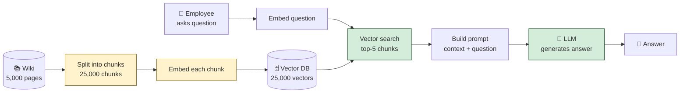

# The Librarian Who Never Forgets

There's a librarian. Let's call her Marta.

Marta has a peculiar condition: she cannot remember anything. Not her own name, not what she had for breakfast, not the book you asked about thirty seconds ago. Her memory is a sieve.

But Marta has a superpower. She can walk into the library — any library — and find any book in seconds. She knows exactly which shelf, which row, which volume. She can pull the right book for any question, open it to the right page, and read you the relevant paragraph. Then immediately forget she did it.

If you ask Marta a question, here's what she does:

1. She walks into the library.
2. She pulls the three or four books most likely to contain the answer.
3. She opens them, finds the relevant pages, and lays them out on the desk.
4. She reads the pages, thinks out loud, and answers your question.

That's it. That's the whole trick. Marta isn't smart because she *knows* things. She's smart because she can *find* things, and she can read.

This is RAG.

---

## Remember — name it

**RAG** stands for **Retrieval-Augmented Generation.** It's a pattern for using an LLM (a language model — Marta) on top of a knowledge base (the library) that the LLM doesn't have memorized.

The three words in order:

- **Retrieval** — find the relevant documents. Marta walks into the library and pulls books.
- **Augmented** — stuff those documents into the LLM's prompt. Marta lays the open books on the desk in front of her.
- **Generation** — the LLM reads the prompt (including the retrieved documents) and produces an answer. Marta reads the pages and answers your question.

A few more words you'll need:

- **Embedding** — a numerical representation of text as a vector. The "GPS coordinates of meaning." Texts with similar meaning have similar coordinates. We use embeddings to find relevant documents.
- **Vector database** — a database optimized for storing and searching embeddings. The library's catalog, organized not by title or author but by meaning.
- **Chunk** — a piece of a document. We don't retrieve whole books; we retrieve chapters or pages. Marta pulls the relevant *pages*, not the whole book.
- **Prompt** — the text we hand the LLM. Includes instructions, the user's question, and the retrieved chunks.
- **Context window** — how much text the LLM can hold in mind at once. Marta's desk — it can only fit so many open books.

That's the vocabulary. Now let's understand why RAG exists at all.

---

## Understand — why RAG exists

An LLM, on its own, is Marta without the library.

It has a vast amount of knowledge baked into its weights during training — the equivalent of having read the entire internet once, in 2023. But that knowledge has three problems:

**Problem 1: it's frozen in time.** The LLM doesn't know anything that happened after its training cutoff. If you ask it "who won the election?" it might confidently give you the wrong answer, because in *its* memory, the election hasn't happened yet.

**Problem 2: it doesn't know your private stuff.** The LLM has never seen your company's HR handbook. It has never seen your customer's support tickets. It has never seen your codebase. Asking it "what's our refund policy?" is asking Marta a question about a book she's never read.

**Problem 3: it hallucinates.** When an LLM doesn't know something, it doesn't say "I don't know." It generates plausible-sounding text that may or may not be true. This is a feature of how LLMs work (they predict plausible text, not true text), and it's the single biggest reason people don't trust them in production.

RAG solves all three problems.

- **Time:** retrieve the latest documents, hand them to the LLM, ask the question. The LLM answers from *current* sources.
- **Private data:** retrieve from your own knowledge base. The LLM answers from *your* documents.
- **Hallucination:** if the prompt includes the relevant documents and instructs the LLM to "answer only from the provided context," the LLM is *grounded* — it's reading from the page, not inventing. Hallucinations don't disappear, but they drop dramatically.

**The deeper pattern:** RAG isn't a trick. It's a *separation of concerns*. The LLM is good at reading and reasoning. It's bad at memorization and factuality. RAG splits the job: the knowledge base handles memory, the LLM handles reasoning. Each does what it's good at.

This is the same insight as the candidate-generation-then-ranking split in recommendation systems. Big AI systems are almost always *pipelines*, not single models. The art is in knowing where to draw the lines.

---

## Apply — design one

Let's design a RAG system for a company's internal support bot. Employees ask "how do I reset my password?" and the bot answers from the company's IT wiki.

**The setup:** 5,000 wiki pages, average 2,000 words each. Employees ask ~100 questions per day. Budget: 5 seconds end-to-end per question.

**Step 1: Chunking (offline, done once).**

We don't retrieve whole pages — they're too big to fit in the context window, and most of a page is irrelevant to most questions. We split each page into chunks.

How? A few options:

- *Fixed-size chunks:* every 500 words. Simple, but can split sentences and lose meaning.
- *Sentence-aware chunks:* split at sentence boundaries, target ~500 words. Better.
- *Structural chunks:* split at headings. Best when documents have meaningful structure (a wiki page's H2 sections usually map to topics).

For our wiki: structural chunks at H2 boundaries, with 50-word overlap between adjacent chunks (so a chunk that ends mid-idea gets continued in the next one). Average chunk: ~400 words. Total chunks: ~25,000.

**Step 2: Embedding (offline, done once, redone when wiki updates).**

Each chunk gets embedded — converted to a vector. We use an embedding model (OpenAI's `text-embedding-3-small`, or a self-hosted alternative like `bge-large`). Each chunk becomes a 1,536-dimensional vector.

The 25,000 vectors go into a vector database — Pinecone, Weaviate, or `pgvector` if we're already on Postgres.

**Step 3: Retrieval (online, ~200ms per query).**

When an employee asks "how do I reset my password?":

1. Embed the question using the same embedding model. (One API call, ~50ms.)
2. Search the vector database for the top-K most similar chunks. (K=5 is a reasonable default. ~50ms.)
3. Return those 5 chunks, with their text and their similarity scores.

**Step 4: Augmentation (online, ~10ms).**

Build the prompt:

```
You are an internal IT support assistant. Answer the user's question
using only the provided context. If the context doesn't contain the
answer, say "I don't know" — do not make up an answer.

Context:
[chunk 1: from "Account Security" page, with similarity score 0.91]
[chunk 2: from "Password Reset" page, with similarity score 0.88]
[chunk 3: from "SSO Setup" page, with similarity score 0.72]
[chunk 4: from "Account Recovery" page, with similarity score 0.69]
[chunk 5: from "Mobile Device Setup" page, with similarity score 0.61]

User question: how do I reset my password?
```

**Step 5: Generation (online, ~2-3 seconds).**

Send the prompt to the LLM. It reads the context, reads the question, and generates the answer. The answer is grounded in the retrieved chunks — the LLM is reading from the page.

**Total latency:** ~50ms (embed query) + ~50ms (vector search) + ~10ms (build prompt) + ~2,500ms (LLM generation) = ~2.6 seconds. Comfortably under budget.

Here's the pipeline:



Yellow = offline preparation. Green = online request flow. The offline pipeline runs once (and again whenever the wiki updates). The online pipeline runs per question.

---

## Analyze — where it breaks

RAG looks simple in the diagram. It is not simple in practice. Here's where it breaks.

**Break #1: retrieval quality is the bottleneck.**

This is the most important thing to understand about RAG, and most beginners miss it: **if retrieval misses the right chunk, generation cannot recover.** The LLM can only read what's on the desk. If Marta pulls the wrong books, no amount of reading skill will produce the right answer.

This means RAG debugging is *mostly retrieval debugging*. When the bot gives a wrong answer, the question isn't "why did the LLM hallucinate?" — it's "did we retrieve the right chunks?" Usually, no.

Common retrieval failure modes:

- *Chunk too small:* the chunk doesn't contain enough context for the embedding to capture its meaning. Embeddings of "To reset your password, click the 'Forgot Password' link on the login page." and "Click the link to continue." might look very different, even though they're part of the same instruction.
- *Chunk too big:* the chunk contains the answer buried in irrelevant text. The embedding averages over too much meaning and matches the wrong queries.
- *Vocabulary mismatch:* the user asks "how do I unlock my account?" but the wiki says "account recovery." Embeddings usually bridge this gap, but not always.
- *Multi-hop questions:* "what's the difference between our password reset process for employees vs. contractors?" requires retrieving *two* chunks and synthesizing. Single-query retrieval gets one or the other, rarely both.

**Break #2: the context window is not infinite.**

You can't retrieve 100 chunks and stuff them all in. The LLM has a context window — typically 8K to 200K tokens depending on the model. Stuff too much in, and:

- You hit the limit and the LLM truncates your prompt (silently).
- The LLM's attention degrades — it pays less attention to content in the middle of long contexts (the "lost in the middle" problem, documented in 2023).
- Cost goes up — you pay per token, both for the prompt and (often) for the KV cache computation.

**Break #3: the LLM ignores the context.**

Even with the right chunks in the prompt, the LLM might:

- Hallucinate anyway, especially if the question is similar to something in its training data.
- Misread the chunks, especially if they're technical or dense.
- Refuse to answer if the chunks are ambiguous or if the system prompt is too cautious.

**Break #4: stale data.**

The wiki updates. The vector database doesn't automatically. If someone updates the password-reset procedure on Monday and the vector DB was last embedded on Sunday, the bot will give the *old* procedure on Tuesday — confidently, because the chunk it retrieved *was* the right one, just out of date.

The fix is a *re-embedding pipeline*: when the wiki updates, re-embed the affected chunks and update the vector DB. Easy to say; surprisingly fiddly to operate at scale.

---

## Evaluate — the chunking tradeoff

The single highest-leverage decision in a RAG system is **how you chunk.** It's also the most under-discussed.

*Small chunks (100-200 words):*

- Pros: each chunk has a tight, specific meaning. Embeddings are precise. You can fit more chunks in the context window.
- Cons: chunks may not contain enough context to be self-contained. The LLM sees fragments, not whole ideas. Multi-sentence reasoning breaks.

*Large chunks (1,000-2,000 words):*

- Pros: each chunk is self-contained. The LLM sees complete reasoning.
- Cons: embeddings average over too much meaning. Vector search returns chunks that *contain* the answer somewhere, but the LLM has to find it. You can fit fewer chunks in the context window.

*Structural chunks (split at headings):*

- Pros: chunks map to the document's natural semantic boundaries. Self-contained by design.
- Cons: depends on the document being well-structured. A wall-of-text document gets one giant chunk.

**The pattern:** there is no universal best chunk size. There's the best chunk size *for your documents, your queries, and your model*. You find it by:

1. Building a small evaluation set (50 questions with known-correct answers).
2. Trying chunk sizes 200, 500, 1,000, structural.
3. Measuring retrieval recall and answer correctness for each.
4. Picking the winner.

This is system design as empiricism, again. You don't reason your way to the right chunk size. You measure your way there. But you have to know *that chunk size matters* and *why* — otherwise you'll spend weeks tuning the LLM and never touch the actual bottleneck.

---

## Create — design a RAG system for a legal research bot

You're building a tool for lawyers. They ask questions like "what's the statute of limitations on product liability claims in California?" and the bot answers from a corpus of state statutes and case law.

Sketch the system.

Questions to chew on:

- The corpus is huge (millions of documents) and structured (statute → section → subsection). How does that shape your chunking?
- Some queries need *current* law (the 2026 statute), some need *historical* law (the law as it stood in 2019). How do you handle time?
- Lawyers will not tolerate hallucination. How do you make the bot say "I don't know" reliably?
- Citations matter — every claim must point to the specific statute and section it came from. How do you preserve provenance through the pipeline?

There's no "correct" answer. Sketch it. Defend it.

---

## A common misconception

**"RAG = 'search the docs and stuff them into the prompt.'"**

This is the most common simplification of RAG, and it hides everything that matters.

The simplification treats RAG as a single step: search → stuff → generate. In reality, RAG is a *pipeline* with at least five stages (chunk, embed, retrieve, augment, generate), each with its own design decisions, failure modes, and tradeoffs.

The simplification also hides *where the quality comes from*. "Search the docs" implies the search is the easy part and the LLM is the hard part. In practice, it's the opposite: the LLM is a commodity (any frontier model will do), and the retrieval pipeline is where 90% of the quality lives. The teams that win at RAG are the teams that obsess over chunking, embedding, reranking, and evaluation — not the teams that switch from GPT-4 to Claude and call it a day.

Finally, the simplification hides the engineering. "Stuff them into the prompt" implies a static operation. In practice, the augmentation step involves:

- Choosing how many chunks to include (context budget).
- Ordering them (recency? relevance? the "lost in the middle" problem suggests the middle is forgettable).
- Compressing them (some systems summarize chunks before stuffing).
- Adding metadata (source, date, confidence) so the LLM can reason about provenance.

RAG is a system, not a trick. Treat it as a system, and you'll build something that works. Treat it as a trick, and you'll ship a demo that breaks the first time a user asks a question that wasn't in your test set.

---

## Explain it back

Close the laptop. Out loud, in your own words:

> "RAG stands for _____. The reason it exists is that LLMs have three problems: _____, _____, and _____. RAG solves them by _____. The pipeline has (at least) five stages: _____, _____, _____, _____, and _____. The single most important thing to understand about RAG is that _____ is the bottleneck, because if _____, then _____, no matter how good the LLM is."

If you can fill those blanks in your own words, you understand RAG. If you can't, re-read "Understand" and "Apply."

---

## Go deeper

For the staff-level reference — HNSW vs. IVF indexing, cross-encoder reranking math, evaluation frameworks like RAGAS — graduate to [ai-system-design-guide § RAG](https://github.com/ombharatiya/ai-system-design-guide#rag).

Next in the curriculum: [B.3 — The Index That Speaks in Numbers](../02-genai-system-design/b3-the-index-that-speaks-in-numbers.md) goes deep on vector databases — the library catalog that makes retrieval possible at scale. We used one in this chapter without explaining how it works. The next chapter fixes that.
