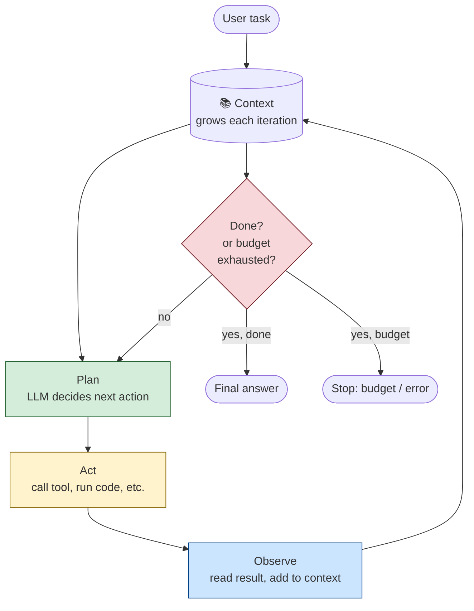

# The Loop That Won't Stop

Picture a junior employee. Let's call him Devon.

You hand Devon a task: "Find out why our signup conversion dropped 12% last week, and write a one-page summary for the exec meeting on Thursday."

Devon doesn't just *answer* — he's not a chatbot. He *works*. He:

1. **Plans**: "Okay, I need to look at signup analytics, compare to last week, identify where the drop is, figure out why, and write it up."
2. **Acts**: He opens the analytics dashboard. He pulls the numbers. He compares them to the prior week. He notices the drop is concentrated on mobile.
3. **Observes**: "Mobile signups dropped 30%. Desktop is flat. Something's wrong with mobile signup."
4. **Plans again**: "I need to check if there was a mobile deploy last week. Let me look at the release log."
5. **Acts again**: Opens the release log. Sees a new mobile signup form shipped Tuesday.
6. **Observes again**: "Tuesday deploy. Drop started Wednesday. Correlation."
7. **Plans again**: "I should talk to the mobile engineer who shipped it."
8. **Acts again**: Slacks the engineer. Gets a reply: "Oh — we added a captcha step. Maybe that's friction."
9. **Observes again**: "Captcha added Tuesday. Drop started Wednesday. Likely cause."
10. **Plans again**: "I have enough. Time to write the summary."
11. **Acts again**: Writes the one-page summary.
12. **Observes again**: Reads it over. Looks good.
13. **Done.** Hands it to you.

Notice what Devon did. He didn't answer your question in one shot. He worked in a **loop**: plan → act → observe → repeat, until the task was done. Each step fed the next. Each observation reshaped the plan. The loop terminated when the task was complete (or when you told him to stop, or when he ran out of time).

**That loop is what makes something an agent.** Not the LLM. Not the tools. The loop.

This chapter is about that loop. By the end, you should be able to describe it precisely, name the termination conditions, and design the *budget problem* — the part that determines whether your agent is a useful employee or a runaway one.

---

## Remember — name it

- **Agent** — an AI system that takes actions in the world, not just produces text. Devon, not a chatbot.
- **Agent loop** — the core pattern: plan → act → observe → repeat, until done or until budget exhausted.
- **Plan** — decide what to do next, given everything observed so far. The LLM's main job in an agent.
- **Act** — execute the plan: call a tool, run code, query a database, send a message. Often the most expensive step.
- **Observe** — read the result of the action, add it to the context, decide whether the task is done or needs another loop.
- **Tool** — a function the agent can call. "Search the web," "run SQL," "send a Slack message," "open a URL."
- **Termination condition** — what makes the loop stop. "Task is complete," "budget exhausted," "maximum iterations reached," "user interrupted," "error threshold exceeded."
- **Budget** — the cap on resources: number of iterations, total tokens consumed, total dollars spent, wall-clock time. The kill switch.
- **Context** — everything the agent has seen so far. The plan, all actions taken, all observations. This grows with each loop iteration.

Hold those loosely. The four you really need: plan, act, observe, terminate. Everything else is variation.

---

## Understand — explain it in plain words

An agent is **not** just an LLM that can call functions. That's a common simplification, and it hides the most important part.

An agent is an LLM **embedded in a loop**, where each iteration of the loop:

1. **Feeds the LLM everything observed so far** (the context).
2. **Asks the LLM to decide what to do next** (the plan).
3. **Executes that decision** (the act — which may be a tool call, or may be "I'm done, here's the answer").
4. **Adds the result to the context** (the observation).
5. **Checks whether to terminate** (done? budget exhausted? error?).

If termination: return the final answer.
If not: loop.

Here's the loop, drawn:



Green = LLM thinking. Yellow = tool execution. Blue = context update. Red = the termination check — the most important and most under-designed part of any agent.

**The reason this matters:** without the loop, you have a chatbot. With the loop, you have something that can do *work* — multi-step, stateful, adaptive work that no single LLM call could accomplish.

Devon couldn't have written the exec summary in one shot. He needed to look at analytics, notice the mobile concentration, check the release log, talk to the engineer. Each step depended on the previous. The loop is what made the work possible.

But the loop is also what makes agents *dangerous*. A loop that won't stop is a runaway process. We'll come back to this.

---

## Apply — design a research agent

Let's design a real agent. The setup: a "research agent" that takes a question, searches the web, reads sources, and writes a cited summary.

**The task:** "Is the global semiconductor shortage expected to ease in 2026?"

**The tools available to the agent:**

- `web_search(query)` — returns a list of URLs and snippets.
- `fetch_page(url)` — returns the full text of a webpage.
- `write_summary(text)` — appends to the running summary document.
- `finish(summary)` — terminates the loop and returns the final answer.

**The context (initial):**

```
System: You are a research agent. Your job is to answer the user's
question by searching the web, reading sources, and writing a cited
summary. Use the tools available to you. When you have enough
information, call `finish` with your summary.

User: Is the global semiconductor shortage expected to ease in 2026?
```

**Iteration 1:**

- **Plan:** The LLM decides: "I should search the web for recent reports on the semiconductor shortage in 2026."
- **Act:** Call `web_search("semiconductor shortage 2026 forecast")`.
- **Observe:** Tool returns 10 URLs, including a Reuters article, an industry analyst report, and a Bloomberg piece.
- **Check:** Task done? No — we have search results, but haven't read them. Budget exhausted? No. Continue.

**Iteration 2:**

- **Plan:** "I should read the Reuters article and the analyst report — those seem most credible."
- **Act:** Call `fetch_page(url_reuters)` and `fetch_page(url_analyst)`.
- **Observe:** Tool returns the text of both articles. The Reuters article says demand is stabilizing; the analyst report predicts modest supply improvements in H2 2026.
- **Check:** Done? Maybe — but the agent might want one more source for balance. Continue.

**Iteration 3:**

- **Plan:** "I have two sources. Let me get one more for balance — maybe a counterpoint."
- **Act:** Call `web_search("semiconductor shortage 2026 risks")`.
- **Observe:** Returns a third source — a piece about geopolitical risks that could disrupt supply again.
- **Act:** Call `fetch_page(url_risks)`.
- **Observe:** Article lists three risk factors.
- **Check:** Done? Yes — three balanced sources, enough to write a summary.

**Iteration 4:**

- **Plan:** "I have enough. Time to write the summary."
- **Act:** Call `write_summary(...)` with a draft. Then call `finish(summary)`.
- **Observe:** Loop terminates.
- **Final answer:** A one-page summary with three citations.

**The termination conditions we used:**

1. *Task complete* — the LLM itself decided "I have enough" and called `finish`.
2. *Budget exhausted* — we'd cap this at, say, 15 iterations and $5 of LLM cost, whichever comes first.

That's the design. Simple in the abstract, surprisingly fiddly in practice. Let's look at where it breaks.

---

## Analyze — the failure modes

Agents fail in characteristic ways. Knowing them is half the battle.

**Failure #1: the loop that won't stop.**

The LLM keeps searching, never deciding it has enough. Each iteration adds a new source, but the LLM is never confident enough to call `finish`. The loop runs until the budget is exhausted, then returns whatever it has — usually worse than if it had stopped three iterations earlier.

*Why it happens:* LLMs are biased toward continuation. "Maybe one more search will be better" feels safer than "I'm done." Without an explicit termination signal, the default behavior is to keep going.

*Fix:* explicit stopping rules. "After 5 sources, you must call `finish`." Or: "If the last search returned no new information, call `finish`." Make termination a first-class instruction, not a hope.

**Failure #2: the loop that stops too early.**

The opposite problem. The LLM calls `finish` after one search, with insufficient information. The summary is shallow or wrong.

*Why it happens:* LLMs are also biased toward satisfying the user quickly. The first plausible-looking answer feels like "done."

*Fix:* explicit minimums. "You must use at least 3 sources before calling `finish`." Or: a separate "evaluator" step that scores the draft summary and only allows termination if the score is above a threshold.

**Failure #3: the loop that drifts.**

The agent starts researching the semiconductor shortage, finds an interesting tangent about TSMC's new fab in Arizona, and ends up writing a summary about US-China trade policy. The original question is lost.

*Why it happens:* each observation reshapes the context, and the LLM's attention shifts to whatever's most salient. Without an anchor to the original task, the agent drifts.

*Fix:* re-inject the original task at every iteration. The system prompt should say: "Remember: your task is [X]. Do not pursue tangents unless directly relevant to [X]." Some production agents also include a "task state" object that the LLM must update each iteration, forcing it to explicitly track progress.

**Failure #4: the loop that errors silently.**

A tool call fails — `fetch_page` returns a 404, or `web_search` times out. The LLM doesn't notice, treats the empty result as "no information found," and proceeds with bad data. The final summary is confidently wrong.

*Why it happens:* tool errors are often returned as empty strings or generic error messages, which look like "no results" to the LLM.

*Fix:* make tool errors loud. Return structured error objects that the LLM is instructed to treat as "this source is unavailable, try a different one" rather than "this source confirms the absence of information."

**Failure #5: the loop that goes off-budget.**

Each iteration consumes tokens (the context grows). Each tool call may cost money (paid APIs, compute). Without explicit budgets, a single agent run can rack up $50 in LLM costs before anyone notices.

*Why it happens:* the loop is unbounded by default. The LLM doesn't know how much it's spending.

*Fix:* hard budgets, enforced by the orchestrator (not the LLM). "Maximum 15 iterations. Maximum 50,000 tokens. Maximum $5. Whichever is hit first, terminate." The LLM should be told the budget so it can plan accordingly, but the orchestrator enforces it regardless.

---

## Evaluate — the budget problem

The budget problem is the central tradeoff of agent design, and it has no closed-form solution.

**A generous budget (many iterations, high token cap, high dollar cap):**

- Pros: the agent can do thorough work. It can explore multiple sources, double-check findings, recover from dead ends.
- Cons: expensive. Slow. The loop can run away before anyone notices.

**A tight budget (few iterations, low token cap, low dollar cap):**

- Pros: cheap. Fast. Predictable.
- Cons: the agent may not have enough room to do the task. It stops mid-investigation, returning a half-finished answer.

**The pattern:** the budget should be *calibrated to the task value*. A research agent writing a one-page summary for an exec meeting might be worth $5 of compute. An agent writing a 50-page market analysis might be worth $200. An agent running a stock trade might be worth $0.50 (and have hard wall-clock limits of 30 seconds).

The mistake is to set the budget *once, globally* — "all agents get 10 iterations and $2." Different tasks have different value, and the budget should reflect that.

The deeper mistake is to set the budget *without telling the LLM*. The LLM can't plan around a budget it doesn't know about. If it knows "you have $5 and 15 iterations," it can decide to skip the third search and write the summary now. If it doesn't know, it just keeps going until the orchestrator kills it — at which point the work-in-progress is lost.

**The pattern, refined:** tell the LLM the budget. Enforce it in the orchestrator. Make the budget per-task, not global.

---

## Create — design a coding agent

You're building an agent that takes a bug report and produces a fix. The tools available:

- `read_file(path)` — read a file in the repo.
- `grep(pattern)` — search the codebase.
- `write_file(path, content)` — modify a file.
- `run_tests()` — run the test suite.
- `finish(diff, explanation)` — submit the fix.

Sketch the agent. Specifically:

- What's the system prompt? What rules do you give it?
- What's the budget? (Iterations, tokens, dollars, wall-clock.)
- What are the termination conditions? (Beyond "task complete" and "budget exhausted" — are there others?)
- What failure mode from the "Analyze" section are you most worried about, and how does your design mitigate it?

There's no correct answer. There's the answer you'd defend in a design review.

---

## A common misconception

**"Agents are just LLMs with a while loop."**

This is technically true and profoundly misleading. It's like saying "a car is just an engine with wheels." Yes, but also no.

The while loop is the easy part — ten lines of Python. The hard parts are:

**The orchestration layer.** The loop needs to: build the context each iteration, call the LLM, parse the LLM's response into a tool call, execute the tool, capture the result, handle errors, check the budget, log everything for observability. That's a few hundred lines of careful code, and getting any of it wrong produces silent failures.

**The termination design.** A while loop has a condition. For agents, the condition is the entire budget problem — iterations, tokens, dollars, wall-clock, task completion signals, error thresholds. Get this wrong and you get either shallow answers or runaway costs. There is no default; you must design it.

**The tool interface.** Tools need schemas, error handling, timeouts, retries, permission boundaries. A poorly-designed tool interface makes the agent fumble every call. A well-designed one makes the agent feel competent.

**The context management.** Each iteration adds to the context. Eventually the context exceeds the LLM's window. You need strategies: summarization, forgetting, sliding windows, external memory. None of these are automatic.

**The evaluation.** How do you know if the agent did a good job? There's no single metric. You need task-specific evals, often themselves LLM-based, with their own failure modes.

The while loop is the shape of an agent. The system design is the substance. Calling an agent "an LLM with a while loop" is like calling a building "a pile of bricks with a roof." Technically accurate. Practically useless.

---

## Explain it back

Close the laptop. Out loud, in your own words:

> "An agent is _____. The thing that makes it an agent, rather than a chatbot, is _____. The loop has (at least) four steps: _____, _____, _____, and a termination check. The termination check matters because _____. The budget problem is the tradeoff between _____ and _____. One failure mode I'm now aware of is _____, and a fix for it is _____."

If you can fill those blanks in your own words, you understand the agent loop. If you can't, re-read "Understand" and "Apply."

---

## Go deeper

For the staff-level reference — ReAct, Reflexion, Plan-and-Solve, the actual prompting patterns, multi-agent orchestration frameworks — graduate to [ai-system-design-guide § Agentic Systems](https://github.com/ombharatiya/ai-system-design-guide#agentic-systems).

Next in the curriculum: [C.2 — The Tools in the Toolbox](../03-agentic-system-design/c2-the-tools-in-the-toolbox.md) goes deep on tool use and the Model Context Protocol — the standard that lets agents plug into external systems without a custom integration for every tool.
