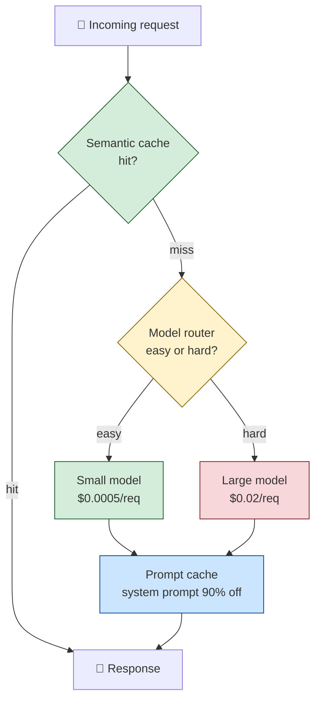

# The Bill Nobody Warned You About

It's week three. Your startup launched a chatbot two weeks ago — a customer support assistant built on a frontier LLM. You were smart about it: you tested it, you shipped it, users like it, the support team is thrilled.

Then the cloud bill arrives.

It's $47,000. For one month. For one chatbot.

Your CFO wants a meeting. Your CEO wants a meeting. The investor who funded the last round wants a meeting. You're sitting at your desk thinking: *what happened?*

Here's what happened. You launched without a cost model. You picked the frontier model because it gave the best demo. You didn't cache anything, because caching seemed like a premature optimization. You sent every request — including "hi" and "thanks" and "what are your hours?" — to the $0.015-per-1K-token model. You included the full 8,000-token system prompt on every request. You didn't track token consumption per user, so you didn't notice the one power user who was sending 400 messages a day.

This chapter is about what to do now, and how to never be in that meeting again. By the end, you should be able to look at any AI system and identify four specific levers for cutting its cost 10x without cutting its quality.

But first, the story of how that bill got so big.

---

## Remember — name it

- **Token** — the unit of text an LLM processes. Roughly 4 characters of English. You pay per token, both for input (prompt) and output (generation).
- **Input tokens** — what you send to the LLM. Includes the system prompt, the user message, retrieved context, conversation history. Often 10x larger than output.
- **Output tokens** — what the LLM sends back. Usually 2-5x more expensive per token than input.
- **Prompt caching** — a feature (offered by Anthropic, OpenAI, and others) where repeated prompt prefixes are cached and charged at a steep discount (often 90% off). If your system prompt is the same on every request, you should be paying 10% of full price for it.
- **Semantic caching** — caching *answers* to similar questions. If two users ask "how do I reset my password?" you can serve the second one from cache. Requires embedding similarity, not exact match.
- **Model routing** — using a cheap model for easy requests and an expensive model only for hard ones. A classifier decides which.
- **Model distillation** — training a smaller, cheaper model to mimic a larger one for a specific task.
- **FinOps** — the discipline of managing cloud costs. Cloud Financial Operations. The accounting department that notices the kitchen is throwing away half its ingredients.
- **Cost-per-request** — the unit economics of your AI system. Total spend ÷ total requests. The number that determines whether your business model works.

Hold those loosely. The four you really need: input vs. output tokens, prompt caching, semantic caching, model routing. Those are your four levers.

---

## Understand — explain it in plain words

AI systems are expensive in a way traditional software isn't. Traditional software has *fixed* costs (servers) and *near-zero* marginal costs (one more user costs almost nothing). AI systems have *variable* costs that scale with usage — every request consumes tokens, every token costs money, and the relationship is linear.

This breaks a lot of intuition.

**Break #1: "more users = more revenue" stops being obviously true.** If your cost-per-request is $0.05 and your revenue-per-request is $0.03, more users just means you lose money faster. This is the AI startup death spiral. Traditional SaaS could acquire users cheaply and monetize them later. AI SaaS has to nail unit economics from day one, or it dies.

**Break #2: "we'll optimize later" stops being a safe default.** In traditional software, premature optimization is a sin. In AI systems, it's a survival skill. A 10x cost overrun in week three is not a "later" problem — it's a "the company might not survive to week six" problem.

**Break #3: free tier abuse is existential.** A free tier in traditional SaaS costs you ~$0.01/user/month in server costs. A free tier in an AI product can cost $5-$50/user/month in token costs. Bot operators and abusers will find you within hours of launch. Without rate limits and abuse detection, your free tier can rack up five-figure bills in a weekend.

**The deeper pattern:** AI costs are *request-shaped*. They scale with what users do, not with how many users you have. A single power user sending 1,000 requests a day can cost more than 1,000 casual users sending one request each. This means cost optimization isn't about "users" — it's about *requests*.

Here are the four levers, in order of impact:

Green = cheap path. Yellow = routing decision. Red = expensive path (minimize this). Blue = caching multiplier applied to whatever path you take.

Let's go through each lever.

---

## Apply — the four levers, in order

### Lever 1: Reduce the number of requests that hit the LLM at all.

The cheapest LLM call is the one you don't make.

**Semantic caching.** Embed each incoming query. Before calling the LLM, check if a similar query is in the cache (cosine similarity > 0.95, say). If yes, return the cached answer. If no, call the LLM, store the answer in the cache.

For a customer support bot, this is huge — 40-60% of queries are repeats ("how do I reset my password," "what are your hours," "where's my order"). A semantic cache can cut your LLM calls in half overnight.

**Rule-based fallbacks.** Some queries don't need an LLM at all. "What are your hours?" can be answered by a lookup. "Track my order #12345" can be answered by a database query. A cheap classifier (or even regex) can route these away from the LLM entirely.

**Conversation summarization.** In a multi-turn chat, you don't need to send the full conversation history on every turn. After 5-10 turns, summarize the conversation and send the summary + the last 2 turns. This cuts input tokens dramatically without much quality loss.

### Lever 2: Make each request cheaper via prompt caching.

If your system prompt is the same on every request (and it should be — that's the whole point of a system prompt), use your provider's prompt caching feature.

Anthropic's prompt caching (introduced 2024) caches prompt prefixes for 5 minutes or 1 hour, charging ~10% of normal input token rates for cached portions. OpenAI has a similar feature, automatic for prompts over 1,024 tokens.

**The math:** if your system prompt is 4,000 tokens and your per-request user input is 200 tokens, prompt caching cuts your input cost from `(4,000 + 200) × $0.003/1K = $0.0126` to `(4,000 × $0.0003/1K) + (200 × $0.003/1K) = $0.0018`. That's a 7x reduction in input cost, with zero quality loss. It's free money.

**The catch:** the cache has a TTL. If your traffic is bursty, the cache may expire between bursts, and you pay full price. For high-traffic systems, this isn't an issue. For low-traffic systems, you may need to artificially warm the cache.

### Lever 3: Route requests to the cheapest model that can handle them.

Not every request needs a frontier model.

**"Hi" doesn't need GPT-4.** A small model (Claude Haiku, GPT-4o-mini, Gemini Flash, Llama 3 8B) can handle greetings, simple Q&A, and basic tool use at 1/20th the cost of a frontier model.

**A model router** is a small, cheap classifier that decides which model to send each request to. It can be:

- A rule-based router (regex + keyword matching). Cheap, brittle.
- A small embedding classifier (embed the query, classify based on similarity to known-easy and known-hard examples). Better.
- A small LLM (Haiku-class) that reads the query and outputs "easy" or "hard." Best, but adds latency.

**The pattern:** route 70-80% of requests to the cheap model, 20-30% to the expensive model. Overall cost drops 5-10x, with minimal quality loss — the expensive model handles the cases where quality matters, the cheap model handles the rest.

**The trap:** routing errors are silent. If the router sends a hard request to the cheap model and the cheap model flubs it, the user gets a bad answer and you don't know why. You need observability on routing decisions — log which model handled each request, and sample bad answers to check whether routing was the cause.

### Lever 4: Reduce tokens per request.

The last lever, and the most labor-intensive.

**Shorter system prompts.** Every token in your system prompt is paid on every request. A 4,000-token system prompt that could be 1,500 tokens is costing you 2.5x what it should. Tighten the prose. Remove redundancy. Trust the model more — you don't need to spell out every edge case.

**Better retrieval (in RAG systems).** If you retrieve 10 chunks but only 3 are relevant, you're paying for 7 chunks of irrelevant context. Better chunking, better embeddings, reranking — these aren't just quality improvements, they're cost improvements.

**Structured output.** Asking the LLM to output JSON instead of prose can cut output tokens 2-3x for the same information. The model isn't padding with "Sure, here's the answer:" — it's just emitting the answer.

**Stop sequences.** Tell the LLM to stop generating when it's done. Don't let it ramble. `</end>` or similar tokens, properly configured, prevent the model from generating 200 tokens of "Is there anything else I can help you with today?" filler.

---

## Analyze — where the $47K came from

Back to our startup. Let's diagnose.

**The system:** customer support chatbot. Frontier model ($0.003/1K input, $0.015/1K output). 4,000-token system prompt. Average conversation: 8 turns, 500 input tokens per turn (growing history), 200 output tokens per turn. ~50,000 conversations in the month.

**Per-conversation cost (no optimization):**

- Input: turn 1 = 4,000 + 500 = 4,500 tokens. Turn 2 = 4,000 + 1,000 (history) + 500 = 5,500 tokens. ... Turn 8 = 4,000 + 3,500 (history) + 500 = 8,000 tokens. Sum across 8 turns: ~50,000 input tokens.
- Output: 8 turns × 200 = 1,600 output tokens.
- Cost: (50,000 × $0.003/1K) + (1,600 × $0.015/1K) = $0.15 + $0.024 = $0.174 per conversation.

50,000 conversations × $0.174 = $8,700.

Hmm. That's not $47K. Where's the rest?

**The hidden multipliers:**

1. **No prompt caching.** The 4,000-token system prompt was paid in full on every turn of every conversation. With prompt caching, it would have been ~10% of that. Cost without caching: $0.15 input. Cost with caching: ~$0.05 input. Multiplier: 3x.

2. **No semantic caching.** 50,000 conversations, but ~50% were variations on the same 20 questions ("reset password," "track order," "refund policy"). Without semantic caching, every one of those hit the LLM. With caching, half of them would have been served from cache. Multiplier: 2x.

3. **No model routing.** Every request — including "hi" and "thanks" — went to the frontier model. With routing, 70% would have gone to a small model at 1/20th the cost. Multiplier on the routed portion: ~5x overall.

4. **Power user abuse.** One user sent 8,000 messages in the month — 16% of all traffic, from one account, almost certainly a bot scraping the free tier. Cost: ~$1,400 from one user.

5. **Verbose system prompt.** The 4,000-token prompt could have been 1,500. Multiplier on input: ~1.5x.

6. **No stop sequences.** Output averaged 200 tokens, but ~50 of those were filler ("Is there anything else I can help with?"). Multiplier on output: 1.25x.

Stack those multipliers: $8,700 × 3 × 2 × 5 (on the routed portion, so call it 3 overall) × 1.4 (power user) × 1.3 (verbose + filler) ≈ $47,000. Math checks out.

**The lesson:** no single lever caused the blowup. The blowup came from *stacking* unoptimized choices. Each one alone was a 1.3-2x inefficiency. Stacked, they compounded into a 5x cost overrun.

**The fix:** apply the levers in order. Each one cuts the previous inefficiency.

- Add semantic caching → cut traffic to LLM by 50%.
- Add prompt caching → cut input cost by 70% on remaining requests.
- Add model routing → cut cost per request by 5x on the 70% routed to the small model.
- Tighten the system prompt → cut input cost by 60%.
- Add stop sequences → cut output cost by 25%.
- Add rate limiting → kill the power-user abuse.

Stacked: $47,000 → ~$2,500. A 19x reduction, with minimal quality loss.

---

## Evaluate — the redesign exercise

Here's your turn. You're handed a system with the following profile:

- A RAG-based Q&A bot over a company's documentation.
- 100,000 queries per month.
- Frontier model, $0.003/1K input, $0.015/1K output.
- 2,000-token system prompt.
- Retrieves 8 chunks of 500 tokens each = 4,000 tokens of context per query.
- Average output: 300 tokens.
- Current monthly cost: $6,400.

Redesign this for 1/10th the cost. Sketch the changes you'd make, in order of impact, with the new cost-per-query for each step.

Some questions to chew on:

- Which lever gives you the biggest single reduction? (Hint: it's probably not the model choice.)
- Where would you accept a small quality reduction, and where would you hold the line?
- What observability do you need to add to make sure the cost reduction didn't silently break quality?
- If the company says "we can't risk quality degradation at all," how does your redesign change?

There's no single right answer. There's the redesign you'd defend, with math, in front of the CFO and the head of product simultaneously. That's the real test of FinOps fluency.

---

## Create — the cost monitoring dashboard

A redesign is a one-time fix. The thing that prevents the *next* $47K bill is ongoing observability.

Sketch a cost monitoring dashboard for an AI system. It should answer:

- What's our cost-per-request right now, broken down by model?
- Which users are responsible for the top 10% of costs?
- What's our cache hit rate (semantic and prompt)? Is it dropping?
- What's our routing accuracy — are we sending easy requests to the expensive model?
- Are we within budget for the month, projected to be over, or already over?
- What's the cost-per-feature — which features are expensive, and are they worth it?

The dashboard isn't a chart-dumping exercise. Each metric should drive a specific action. If you can't answer "what would I do if this metric spiked?" for any given metric, cut the metric — it's decoration.

This is the discipline that turns FinOps from a panic exercise into a routine practice.

---

## A common misconception

**"Just use a cheaper model."**

It's the most common cost-reduction advice, and it's the wrong starting point for three reasons.

**Wrong #1: it ignores the bigger levers.** Model choice is one lever of four, and it's rarely the biggest. Semantic caching and prompt caching often give 2-5x reductions *with no quality loss at all*. Switching to a cheaper model might give 5x but with measurable quality loss. The order of operations matters: apply the no-quality-loss levers first, *then* consider model downgrade for what's left.

**Wrong #2: "cheaper model" is under-specified.** There's a 20x cost range between "frontier" and "small" models, and a 10x quality range. The question isn't "use a cheaper model" — it's "use the cheapest model that maintains acceptable quality *for this specific task*." That requires knowing your quality bar, which requires evaluation, which most teams haven't built. Without an eval, "use a cheaper model" is just guessing.

**Wrong #3: model choice is reversible; architecture isn't.** If you switch to a cheaper model and quality drops, you can switch back. If you build a model-routing layer, a semantic cache, and a prompt-caching strategy, those architectural choices persist across model swaps — they make every future model cheaper too. The architectural levers compound. The model-choice lever doesn't.

**The pattern:** start with the architectural levers (caching, routing, request reduction). Get those right, and your cost-per-request drops 5-10x with no model change. *Then* consider whether a cheaper model can take you further. Most teams find they don't need to — the architectural optimizations alone get them to a sustainable cost structure.

---

## Explain it back

Close the laptop. Out loud, in your own words:

> "AI costs are different from traditional software costs because _____. The four cost levers, in order of impact, are _____, _____, _____, and _____. The reason 'just use a cheaper model' is bad advice is _____. The single highest-leverage optimization for most systems is _____, because _____. If I were handed a system with a runaway bill, the first three things I'd check are _____, _____, and _____."

If you can fill those blanks in your own words, you understand AI FinOps. If you can't, re-read "Apply" and "Analyze."

---

## Go deeper

For the staff-level reference — token economics math, GPU vs. API cost breakevens, self-hosting decisions, the actual current pricing of frontier models (which moves constantly) — graduate to [ai-system-design-guide § FinOps](https://github.com/ombharatiya/ai-system-design-guide#finops).

For real-world pricing, always check the provider's pricing page directly — Anthropic, OpenAI, Google, Mistral, Cohere all publish current per-token rates. Anything in a curriculum (including this chapter) is a snapshot in time. The pattern of cost optimization is durable; the specific numbers are not.

Next in the curriculum: [X.5 — When Production Breaks](../04-cross-cutting/x5-when-production-breaks.md) covers real failure patterns from public AI incidents — the cautionary tales that show what happens when cost, safety, and reliability aren't designed together.
