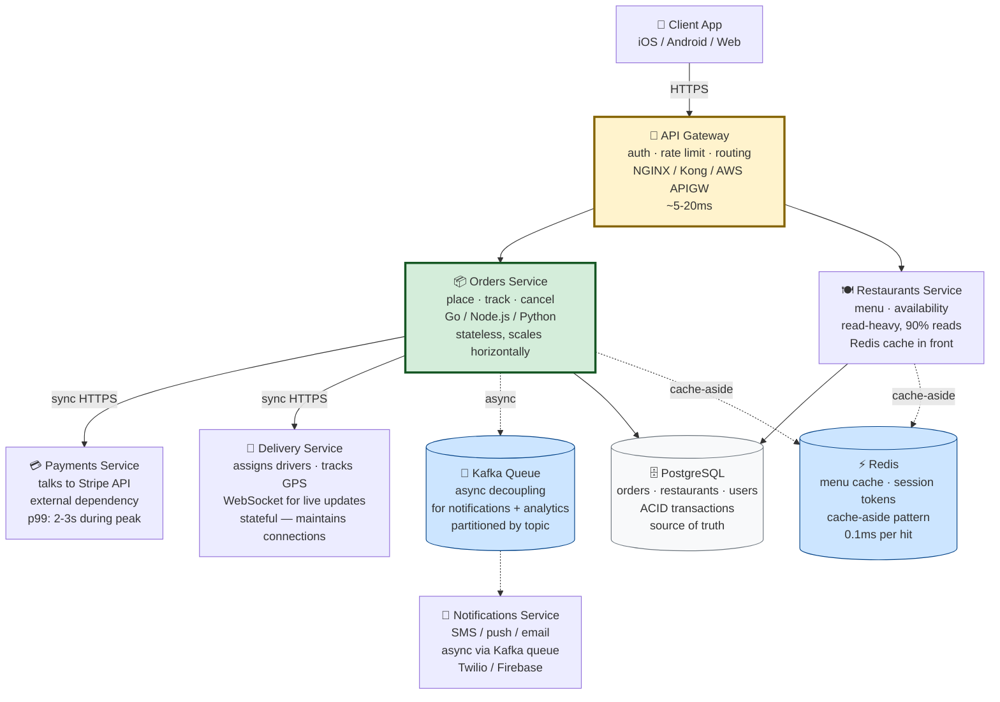

# The Friday Night Problem

It's 7:42 PM on a Friday. You open your food delivery app. You're hungry, you're tired, and you want pad thai from that place on 9th Street — the one that's usually great but always forgets the lime.

You tap. The spinner spins. You wait. The spinner keeps spinning. Then: *restaurant unavailable*.

You try another place. Same spinner. Same outcome. You switch apps. Spinner. Spinner. Spinner. You give up, walk to the corner store, and buy a sad sandwich.

What just happened?

The restaurant wasn't closed. The app wasn't broken. What broke was the **system** behind the app — the collection of services, databases, queues, and external integrations that together make "tap a button, food arrives" possible. On a Tuesday at 2 PM, that system purrs. On a Friday at 7:42 PM, when everyone in your city is opening the app at the same time, it falls over.

This is the **Friday Night Problem**. It's the entire reason system design exists as a discipline. And it's where we start — not with AI, not with models, not with anything fancy. With a hungry person and a spinner that won't stop.

---

## Remember — name it

**System design** is the practice of deciding how to split a piece of software into parts, how those parts talk to each other, and how the whole thing survives when the world gets hard.

That's the term. Hold onto it. Now the vocabulary you'll need for the rest of this curriculum — each with a one-line anchor and a real number:

- **Service** — a piece of software that does one job. Like a kitchen station: the grill cook does grill things, the salad cook does salad things. In production: the orders service, the payments service, the notifications service. Each runs independently, deploys independently, and fails independently.
- **Request / Response** — a single round trip. Client asks, server answers. "Is the pad thai available?" / "Yes." One request-response pair. Measured in milliseconds. A typical web request: 50-200ms. A database query: 1-50ms. An LLM call: 500-5000ms.
- **Latency** — how long a single request takes, start to finish. Measured in milliseconds (ms). *Low latency* feels instant (<100ms). *High latency* feels like the Friday night spinner (>2s). Cellular networks add 50-200ms of baseline; fiber to the home adds 5-20ms; a cross-continent round trip adds 50-150ms.
- **Throughput** — how many requests the system can handle at once, measured in requests per second (RPS). One chef has low throughput. Twenty chefs have high throughput. A single PostgreSQL instance might handle 10,000 simple queries per second; a load-balanced cluster of ten might handle 100,000. A typical web server handles 1,000-10,000 RPS.
- **Scale** — the size of the load the system is built for. A system designed for 100 simultaneous users will die at 100,000, even if the code is perfect. Scale is measured in users, requests, data volume, or all three. Facebook handles ~3 billion users. Your startup handles 1,000. The architecture is different.
- **Tradeoff** — the central act of system design. You can't have everything. Fast, cheap, reliable — pick two. Every design decision gives something up to get something else. This is not a limitation; it's the raw material the discipline works with.
- **Load balancer** — a traffic cop that sits in front of your servers and distributes incoming requests across them. If one server gets overwhelmed or dies, the load balancer stops sending it traffic. NGINX, HAProxy, AWS Application Load Balancer, Cloudflare — all load balancers. They use algorithms like round-robin (equal distribution), least-connections (send to the least busy server), or IP-hash (same client always goes to same server — for session affinity).
- **Cache** — a small, fast storage layer that holds recent or popular answers so the system doesn't have to recompute them. Redis and Memcached are the standard choices. A cache hit is 100x faster than a database query (0.1ms vs 10ms); a cache miss falls through to the database. Cache hit rate is a critical metric — 90%+ is good, <50% means your cache strategy is wrong.
- **Asynchronous (async)** — "I'll get back to you." A pattern where the client sends a request and doesn't wait for the answer — the server processes it later and notifies the client when it's done. Implemented with message queues (Kafka, RabbitMQ, SQS) or background job systems (Celery, Sidekiq). Essential for long-running operations like payment processing, email sending, and ML inference.
- **Graceful degradation** — when part of the system fails, the rest keeps working with reduced functionality. If the recommendations service dies, the homepage still loads — just without recommendations. A restaurant that runs out of one dish still serves the rest of the menu.
- **Circuit breaker** — a pattern that stops calling a failing service. If a service fails N times in a row, the circuit breaker "trips" and stops sending traffic for a cooldown period (e.g., 30 seconds). Like a fuse in an electrical panel — it trips to prevent bigger damage downstream. Popular implementations: Hystrix (Java), resilience4j, Polly (.NET).
- **Single point of failure (SPOF)** — a component whose failure takes down the whole system. The one cashier at a coffee shop — if they go on break, no one gets coffee. Good system design eliminates SPOFs through replication and redundancy. "Never have one of anything that's critical" is the rule.

---

## Understand — why system design exists as a separate discipline

Here's the part most beginners miss, and it's the foundation for everything else in this curriculum.

When you write a small program — a script that reads a file, transforms it, writes it back — your code's correctness is the whole story. If the script works on your laptop, it works. Done. The script either produces the right output or it doesn't. There's no "scale" to worry about, no "throughput" to measure, no "failure modes" to design around.

When you write software that serves a million people at once, correctness is the *floor*, not the ceiling. The script being right doesn't tell you:

- What happens when 10,000 people hit "place order" in the same second?
- What happens when the payment processor (Stripe, Adyen, Braintree) takes 3 seconds to respond instead of 200 milliseconds? (Stripe's p99 latency can be 2-3 seconds during peak — your users will notice.)
- What happens when the recommendation service crashes — does the whole app crash, or does the user still see a working homepage with recommendations just missing?
- What happens when a database write fails halfway through — did the order go through, or didn't it? (This is the *consistency* problem, and it's why databases have transactions — ACID properties: Atomicity, Consistency, Isolation, Durability.)
- What happens when the CEO says "we're launching in three new countries next month" — does the system grow with that, or does it need a rewrite?

**System design is the answer to those questions.** It's the discipline of asking, *before you write the code*: how will this behave when it's big, when it's stressed, when pieces of it fail, when it has to change?

A good system designer doesn't ask "will this work?" They ask "what will this do when it stops working?" — because everything stops working eventually. The question is whether it stops working *gracefully* (degraded service, clear errors, quick recovery) or *catastrophically* (full outage, data loss, customer churn).

### The four questions every system design answers

Strip away the jargon and every system design — from a food delivery app to a multi-billion-parameter LLM training cluster — is answering the same four questions:

1. **What are the parts, and what does each one do?** (Decomposition.) How do you split the work? What's a separate service vs. what's a module within a service? This is the most foundational decision — get it wrong and everything downstream suffers. The principle is *single responsibility*: each service does one thing well.
2. **How do the parts talk to each other?** (Communication.) Synchronously (HTTP, gRPC) or asynchronously (message queues)? What protocol? What serialization format? How do they authenticate each other? Synchronous calls couple services together — if A calls B synchronously, A's latency includes B's latency. Async calls decouple — A publishes a message and moves on.
3. **What happens when a part fails or slows down?** (Resilience.) Timeouts, retries, circuit breakers, fallbacks, graceful degradation. The discipline of assuming everything will fail and designing for it. A common rule: design for the failure of every external dependency.
4. **What happens when load grows or shrinks?** (Scaling.) Horizontal (more instances) vs. vertical (bigger instances). Stateful vs. stateless services. Database sharding. Read replicas. The architecture of growth. Stateless services scale trivially (just add more behind a load balancer); stateful services (databases) are hard.

If you can answer those four questions for any system, you understand its design. If you can't, you don't — no matter how many diagrams you've memorized. These four questions are the skeleton of every system design interview, every architecture review, every postmortem. Internalize them.

### The six words that unlock everything

Every craft has its foundational vocabulary. Cooking has *salt, fat, acid, heat*. Music has *melody, harmony, rhythm, timbre*. System design has its own six — and once you own them, every conversation about architecture stops sounding like a foreign language.

**Client and server.** The asker and the answerer. Your browser is a client. The computer in a data center answering its requests is a server. In a restaurant: you're the client, the kitchen is the server. This seems simple, but the distinction matters because it determines who initiates communication (the client) and who responds (the server). Modern systems blur this — a service can be both a server (to its callers) and a client (to the services it calls) — but the roles are always clear at any given moment.

**Request and response.** The atomic unit of all client-server communication. One question, one answer. Everything else is built on this. When you load a webpage, your browser makes dozens of request-response pairs: one for the HTML, one for each CSS file, one for each image, one for each API call. Understanding this lets you reason about *what* a system is doing at any moment.

**Latency vs. throughput.** The two axes of performance, often confused. *Latency* is how long one request takes, measured in milliseconds. *Throughput* is how many requests happen per unit of time, measured in requests per second. They're related but not the same. A kitchen that handles 1,000 orders an hour but each takes 45 minutes has high throughput, high latency. A kitchen that handles 10 orders an hour but each takes 5 minutes has low throughput, low latency. You can optimize one and hurt the other — adding more chefs increases throughput but if they get in each other's way, latency per dish can increase. This is why performance engineering is a distinct skill.

**Scaling.** Making a system handle more load. *Vertical scaling* = buy a bigger server (more CPU, more RAM, faster disks). One chef who's really fast. Limited by hardware — you can't buy an infinitely big server. *Horizontal scaling* = add more servers (more instances behind a load balancer). Twenty regular chefs. Cheaper and more reliable (if one server dies, the others keep going), but harder to design for — because now your servers need to coordinate, and coordination is where distributed systems get complex. Stateful services (databases) are hard to scale horizontally; stateless services (API servers) are easy. This is why modern architecture separates state (in databases) from compute (in stateless services).

**Tradeoffs.** The central act. You can't have everything — fast, cheap, reliable, pick two. Every design decision gives something up. System design is the art of choosing which things to give up. A system that's perfectly reliable is expensive (triple redundancy, multi-region). A system that's cheap is less reliable (single instance, no backup). A system that's fast might sacrifice consistency for speed (eventual consistency vs. strong consistency). There are no solutions, only tradeoffs. This is the most important word in the entire curriculum.

**Load balancer.** A traffic cop that sits in front of your servers and distributes incoming requests across them. If one server gets overwhelmed or dies, the load balancer stops sending it traffic. The host at a restaurant who decides which table goes to which waiter. Load balancers use different algorithms: round-robin (equal distribution), least-connections (send to the busiest-free server), IP-hash (same client always goes to same server — useful for session affinity). AWS ALB, NGINX, HAProxy, and Cloudflare are all load balancers.

---

## Apply — design a food delivery app

Let's design the food delivery app. Not the AI parts — just the boring skeleton. We want to see system design thinking happen in real time, with real numbers.

**The parts:**

- A **client app** (the thing on your phone — iOS, Android, or web. React Native or Flutter for mobile; Next.js or React for web).
- An **API gateway** (the front door — receives HTTPS requests from the client, handles authentication via JWT, rate limiting via token bucket, and routing. NGINX, Kong, or AWS API Gateway. Typical latency: 5-20ms).
- An **orders service** (handles "place order," "where's my order," "cancel order" — the core business logic. Written in Go, Node.js, or Python. Stateless, scales horizontally).
- A **restaurants service** (handles "is this restaurant available," "what's on the menu" — read-heavy, cache-friendly. 90% of requests are reads, so a Redis cache in front of the database gives 10x throughput).
- A **payments service** (talks to Stripe via Stripe's API, marks the order as paid. External dependency — you don't control Stripe's latency).
- A **delivery service** (assigns drivers, tracks them on the map via WebSocket connections. Stateful — maintains open connections to drivers).
- A **notifications service** (sends "your driver is on the way" SMS via Twilio, push notifications via Firebase Cloud Messaging. Async — uses a message queue).
- A **PostgreSQL database** (orders, restaurants, users — the source of truth. ACID-compliant, handles transactions).
- A **Redis cache** (menu data, session tokens — fast lookups. Cache-aside pattern: read from cache, if miss read from DB and write to cache).

Each of these is a *service*. Each one does one job. None of them knows the full story — they each know their piece, and they talk to each other to make the whole thing work. This is *decomposition*: splitting a complex system into focused, independently-deployable pieces. The principle is *single responsibility* — each service does one thing well.

**How they talk:** the client app talks to the API gateway over HTTPS (port 443, TLS 1.3). The API gateway talks to the internal services over gRPC (Google's high-performance RPC protocol, uses binary Protocol Buffers) or HTTP/JSON — the choice depends on whether you prioritize latency (gRPC, ~2x faster than HTTP/JSON) or debuggability (HTTP/JSON, human-readable). Services talk to each other when they need to — the orders service asks the payments service "did this pay?", then asks the delivery service "find me a driver." These internal calls are synchronous if the caller needs the answer immediately (orders → payments: "did the payment succeed?"), or asynchronous (via a message queue like Kafka) if the caller can proceed without waiting (orders → notifications: "send a confirmation email when you get a chance").

**What happens when a part fails:** if the recommendations service dies (we don't have one in this toy example, but imagine we did), the app should *still work* — the user just doesn't get recommendations. This is called **graceful degradation**. If the payments service dies, the user can still browse, but can't place orders. If the orders service dies, the whole app is dead, because every interesting action routes through it. Notice the asymmetry: not all services are equal. Some failures are graceful degradations (you lose a feature but keep the app). Some failures take the whole system down. System design is the act of *deciding which is which, on purpose, in advance*.

**What happens when load grows:** on a Tuesday at 2 PM, one orders service instance handles all the traffic — maybe 50 requests per second. On a Friday at 7:42 PM, traffic spikes to 5,000 requests per second (100x). You spin up ten instances of the orders service, put a load balancer (AWS ALB) in front of them, and distribute traffic across all ten. The code didn't change — the *topology* changed. That's horizontal scaling. The database is harder to scale (it's stateful), so you might add read replicas (copies of the data that handle read queries, while writes go to the primary) to take pressure off — a common pattern for read-heavy workloads.

Here's the picture:

That's a system design diagram. Boxes are services. Arrows are "talks to." Cylinders are data stores. Dashed lines are async or cache reads. The API gateway is highlighted because it's the chokepoint — everything goes through it. The orders service is highlighted because it's the brain — most interesting logic lives there.

If you can read this diagram, you can read most system design diagrams. They're all variations on this theme.

---

## Analyze — where the food delivery design breaks

Now the interesting part. Where does our design break? This is where system design earns its name — not in the happy path, but in the failure modes.

**The API gateway is a single point of failure.** If it dies, the whole app dies. Even though we have ten copies of the orders service, they're all unreachable if the gateway is down. *Fix:* run multiple gateway instances behind DNS round-robin or a CDN's edge layer (Cloudflare, Fastly). Cost: complexity (you now have multiple gateways to configure and monitor). Benefit: resilience. This is the "never have one of anything critical" rule.

**The orders service is overloaded.** It's doing too much — placing orders, checking status, cancelling, refunding. As the company grows, every team wants to add features to it. It becomes a *god object* — a service that knows about everything, that every team deploys to, that breaks in unpredictable ways when any team changes anything. *Fix:* split it. Orders-placement service, order-status service, refunds service. Cost: more services to operate (more deploy pipelines, more monitoring dashboards, more on-call rotation), more cross-service calls (network latency, failure modes). Benefit: each can scale and fail independently; teams can move faster without stepping on each other. This is the microservices tradeoff — the benefit is organizational, the cost is operational. Martin Fowler's original article on microservices (2014) is still the best treatment of this tradeoff.

**The database is shared.** Every service reads and writes the same PostgreSQL instance. That means a slow query in the restaurants service (someone wrote `SELECT * FROM restaurants` without a LIMIT) can starve the orders service — the database's connection pool is exhausted, and orders can't be written. *Fix:* give each service its own database (the *database-per-service* pattern). Cost: data synchronization becomes a problem (what if restaurants and orders need to know the same thing? You now need event-driven updates or a shared data layer). Benefit: isolation — one service's bad query can't take down another. This is the database equivalent of process isolation.

**The payments service is synchronous.** When you place an order, the orders service *waits* for the payments service to confirm before proceeding. If Stripe is slow (and Stripe's p99 latency can be 2-3 seconds during peak), your order placement is slow. The user taps "place order" and waits 3 seconds for a response — that feels broken. *Fix:* make payments asynchronous — return "order placed, payment processing" immediately, process the Stripe call in the background (via a message queue), notify the user when payment is confirmed or failed. Cost: the user doesn't know immediately whether their card was charged (you need a clear UI for "payment pending"), and you need to handle the "payment failed after order was placed" case (cancel the order, notify the user). Benefit: the orders flow is no longer coupled to Stripe's latency — your app feels fast even when Stripe is slow.

Notice what's happening here. Every fix is a *tradeoff*. We're not eliminating problems; we're choosing which problems to have. That's the central act of system design.

A bad system designer optimizes one thing until everything else breaks. A good system designer holds the whole field of tradeoffs in mind and picks the combination that hurts least for *this specific product, at this specific scale, with these specific users*.

### The latency budget — a real example with real numbers

Let's make this concrete with real numbers. Suppose we're designing for a 2-second end-to-end budget on "place order" (the user taps "place order," and within 2 seconds they see "order confirmed"). This budget comes from product — 2 seconds is roughly the threshold where users start to perceive lag. Under 1 second feels instant. 1-2 seconds feels responsive. Over 2 seconds feels slow. Over 5 seconds feels broken. These numbers come from Jakob Nielsen's classic research on response times (1993, still valid).

Where does the 2 seconds go?

| Component | Time | Notes |
|---|---|---|
| Network (client → gateway) | 100ms | Cellular, typical. Fiber to home: 20ms. 4G: 50-150ms. 5G: 20-50ms. |
| API gateway processing | 20ms | TLS termination, auth check (JWT verification), rate limit, routing. |
| Orders service logic | 50ms | Validate input, check restaurant availability, write to DB. |
| Database write (orders) | 80ms | Synchronous, indexed INSERT + COMMIT. PostgreSQL on SSD. |
| Payments service call | 800ms | Stripe API, typical p50. p99 can be 2-3 seconds. |
| Delivery service call | 200ms | Find a driver, estimate ETA. May query driver location cache. |
| Notifications service | 50ms | Enqueue SMS (async, doesn't block response). |
| Network (gateway → client) | 100ms | Response back to client. |
| **Total** | **1,400ms** | Under budget — for now. |

But what happens when Stripe is slow? Stripe's p99 latency might be 2 seconds, not 800ms. Now our total is 2,600ms — over budget. The user sees a laggy app. The fix isn't "make Stripe faster" (we can't — it's their service). The fix is architectural: make the Stripe call asynchronous. Return "order placed, payment processing" immediately. Confirm payment in the background. Notify the user when it's done.

This is system design as budgeting. You have a fixed amount of time (2 seconds), money (server costs), and reliability (uptime SLA). You allocate them across components. When a component exceeds its allocation, you redesign — not to make it faster, but to decouple it from the critical path. The budget is the tool that turns "the app feels slow" into "the payments service is adding 1.2 seconds to the critical path — let's make it async."

---

## Evaluate — a real tradeoff decision

Let's make this even more concrete. Real decision a real team had to make.

**The scenario:** You're shipping a new feature — "live order tracking on a map." Every second, the client app needs to know where the driver is. Two designs:

**Design A — Polling.** The client app asks the delivery service "where's my driver?" every 2 seconds. The delivery service queries its database (or Redis cache) and returns the latest position. Simple HTTP GET requests.

**Design B — WebSockets.** The client opens a long-lived WebSocket connection to the delivery service. Whenever the driver's position updates (the driver's app sends GPS updates every 2-5 seconds), the delivery service pushes the new position down the open connection to the client.

Which is better?

*Design A is simpler.* No special infrastructure — just HTTP, which you already have. Works through any firewall (HTTP on port 443 is universally allowed). Easy to debug — each request is independent, you can curl it. Each request is stateless, so it scales horizontally trivially (just add more delivery service instances behind a load balancer). No connection management, no reconnection logic, no sticky sessions.

*Design A is more expensive at scale.* If you have a million concurrent orders (each with a user tracking their driver), that's 500,000 requests per second hitting your delivery service (1M orders ÷ 2 seconds = 500K RPS), just to ask "where's my driver?" Most of those answers will be "same place as 2 seconds ago" — the driver hasn't moved. You're burning database queries (or cache lookups) to return unchanged data. At 500K RPS, you need a lot of delivery service instances, a lot of database capacity, and a lot of network bandwidth.

*Design B is more efficient at scale.* One WebSocket connection per order. The server only sends data when the driver's position actually changes — maybe every 3-5 seconds, not every 2 seconds. Far less wasted work. The connection is persistent, so there's no per-request overhead (no TLS handshake, no HTTP headers — just a small data frame).

*Design B is harder to operate.* WebSocket connections break when networks switch (cellular → WiFi is the classic case — the connection drops and has to be re-established). You need a sticky-session load balancer (or a pub/sub backend like Redis Pub/Sub so any delivery service instance can publish to any connection). You need to handle reconnection logic on the client. You need to monitor connection counts as a capacity metric — if you have 1M open connections, you need enough file descriptors and memory on your servers. You need to handle "ghost connections" — connections that the client thinks are open but the server has closed (heartbeats fix this).

**The verdict depends on your scale and your team.** If you have 1,000 concurrent users and a small team, Design A wins — the simplicity is worth the inefficiency. The infrastructure cost of 500 RPS is negligible. If you have 1,000,000 concurrent users, Design A will literally melt your servers — 500K RPS is a serious load that requires significant infrastructure. Design B's complexity becomes the cheaper option, because the alternative is buying 10x more servers.

There is no universally correct answer. There's only the right answer *for your situation* — and a good system designer can articulate both the question and the tradeoff in the same breath. The worst answer is "we'll use WebSockets because they're more modern" or "we'll use polling because it's simpler" — without having done the math.

This is what we mean by "system design is the art of tradeoffs." It's not a formula. It's a judgment, grounded in numbers, defended with reasoning.

---

## Create — design a tiny online bookstore

Your turn. Don't worry about getting it "right" — system design is a craft, not a test. The goal is to practice the thinking, not to produce the one correct answer (there isn't one).

**Design a system for a tiny online bookstore.** The store has:

- 10,000 books in its catalog.
- 100 visitors browsing at any given time.
- 5–10 orders per day.

Sketch the parts. Sketch how they talk. Sketch what fails when one part dies. Sketch what you'd change if traffic grew 100x (to 10,000 visitors, 1,000 orders/day).

Spend ten minutes on this. Draw it on paper if you can — system design is a kinesthetic skill, and the act of drawing matters. Don't type; draw. The physical act of sketching boxes and arrows engages a different kind of thinking than typing.

Some questions to prompt your thinking:

- Does the catalog (the list of books) need its own service, or can it just live in the database? (At 10,000 books, the database can handle it. At 10 million books, you'd want a dedicated catalog service with its own search infrastructure — Elasticsearch or a vector DB for semantic search.)
- When a user places an order, do you synchronously charge their card (wait for Stripe), or do you process payment asynchronously (return immediately, confirm later)? What are the tradeoffs? (Synchronous is simpler but slower. Async is faster but requires handling "payment failed after order placed.")
- If the database dies, can users still browse? Can they still place orders? (If browsing reads from a cache, browsing works. If ordering writes to the database, ordering fails. This is graceful degradation.)
- What happens if two users try to buy the last copy of a book at the same time? (This is called a *race condition* — and it's a system design problem, not just a coding problem. The fix is database transactions with row-level locking, or optimistic concurrency control with version numbers.)
- What's your latency budget for "search for a book"? For "place an order"? For "view my order history"? (Search: 200ms. Place order: 2 seconds. Order history: 500ms. These are typical user expectations based on Nielsen's response time research.)

You don't need to answer all of these. You need to *notice* that they're questions. That's the beginning of system design thinking — the moment you stop asking "does this work?" and start asking "what does this do when it stops working?"

---

## A common misconception

**"System design is just drawing boxes and arrows."**

It looks like that, on the surface. The diagrams are full of boxes and arrows. The interviews are full of diagrams. The blog posts are full of diagrams. It's easy to think the skill is in the drawing.

But the boxes and arrows are the *output* of system design, not the *act* of it. The act of system design is **making tradeoffs under constraints**. The diagram is the artifact that captures those decisions so other people can reason about them.

Two people can draw the same diagram. One of them understands *why each box is there, what failure each arrow implies, what would change if the load doubled, what the latency budget is, where the single points of failure are*. The other is just drawing shapes they saw in a tutorial.

The way you tell the difference: ask "why is this a separate service?" about any box. A real system designer has an answer — and the answer is a tradeoff, not a tautology. "Because it needs to scale independently of the orders service" or "because the payments team owns it and they deploy on their own cadence" or "because if it fails, we don't want it to take down orders — isolation." A box-drawer says "that's how the diagram I copied did it."

The diagram is the map. The tradeoffs are the territory. Don't confuse the two.

---

## Explain it back

Close the laptop. Close the tab. In your own words, out loud, as if to a curious friend who's never heard of any of this:

> "System design is the practice of _____. The four questions every system design answers are _____, _____, _____, and _____. The reason it matters is that _____. The six words that unlock everything are _____, _____, _____, _____, _____, and _____. A tradeoff I can name is _____ vs. _____, where the choice depends on _____. A latency budget is _____, and it matters because _____. A single point of failure is _____, and the rule is _____."

Don't peek at this chapter. If you can fill those blanks in your own words — not the exact words I used, but your own — you understand it. If you can't, go back and read the "Understand" section again. The goal isn't to memorize the definition; the goal is to *own* the concept well enough that you could explain it to someone who's never heard it.

That's the test. Not a quiz. Not a multiple-choice question. Whether you can teach it back.

---

## References

- **Kleppmann, M. (2017), *Designing Data-Intensive Applications*, O'Reilly.** Chapter 1 covers the same four questions at greater depth. The canonical book on system design. https://dataintensive.net
- **Google SRE Book (2016), *Site Reliability Engineering*, O'Reilly.** Free online. Chapter 6 covers monitoring. https://sre.google/sre-book/table-of-contents/
- **Brewer, E. (2000), "Towards Robust Distributed Systems," PODC Keynote.** The CAP theorem. https://people.eecs.berkeley.edu/~brewer/cs262b-2004/PODC-keynote.pdf
- **Vogels, W. (2023), "Distributed Computing Myths."** Why the fallacies of distributed computing are still fallacies. https://www.allthingsdistributed.com/2023/02/distributed-computing-myths.html
- **Nielsen, J. (1993), *Usability Engineering*, Morgan Kaufmann.** The response time research (1s, 2s, 5s thresholds). https://www.nngroup.com/articles/response-times-3-important-limits/
- **Fowler, M. (2014), "Microservices."** The original article on the microservices tradeoff. https://martinfowler.com/articles/microservices.html
- **Brendan Gregg (2020), *Systems Performance*, Addison-Wesley.** Practical latency and throughput analysis. http://www.brendangregg.com/sysperfbook.html
