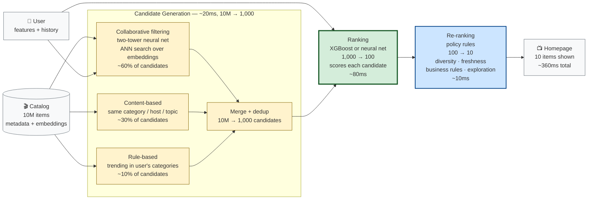

# The Front Page Mind Reader

You open Netflix. Or Spotify. Or YouTube. Or that e-commerce app you can't quit. Before you've typed a single letter, the homepage is full of stuff. Shows you might like. Songs queued up. Products picked "for you."

How?

It's not magic and it's not one model. It's a system — and the system has a shape. A specific, learnable, surprisingly consistent shape that every recommendation system from Netflix to Spotify to Amazon follows, with variations.

This chapter is about that shape. By the end, you should be able to whiteboard a recommendation system, explain why it has the parts it has, and spot the design decisions hiding inside any "for you" feed you encounter.

But first, a story.

---

## The story

Picture a video store. The kind that used to exist on every corner before streaming ate them. You walk in on a Friday night. 10,000 movies on the shelves. You have thirty minutes before your pizza arrives.

The clerk behind the counter — let's call her Maya — has watched you come in for years. She knows you. She knows you love heist movies, can't stand rom-coms, will watch anything with a car chase, and once stayed up until 3 AM finishing that one Spanish thriller she recommended.

You walk up. "What should I watch?"

Maya doesn't pull one movie off the shelf. That would be insane — you might not be in the mood. She pulls *ten*. "These just came in. This one's a heist movie. This one's got a great car chase. This one's the Spanish director you liked. Pick whichever."

You browse the ten. You pick one. You leave happy.

That two-step — *pick ten candidates fast, then rank them carefully* — is the entire shape of a recommendation system. We just gave it a name: **candidate generation** followed by **ranking**. Every other detail is variation on the theme.

Why two steps? Why not just rank all 10,000 movies directly?

Because ranking 10,000 movies *carefully* would take Maya an hour. You'd be standing at the counter forever. Instead, she uses a fast, cheap, *lossy* method to get from 10,000 down to 10 — "anything with a car chase or a heist or that Spanish director." Then she uses a slow, expensive, *precise* method to put those 10 in order.

The art of recommendation system design is: **what's the cheap method, what's the expensive method, and where do you draw the line?**

---

## Remember — name it

Before we go further, the words.

- **Candidate generation** — the first stage. Cheap, fast, lossy. Reduces millions of items down to hundreds or thousands. "Pull everything that might be relevant." Typically uses approximate nearest neighbor (ANN) search over embeddings, or simple rule-based filters.
- **Ranking** — the second stage. Expensive, slow, precise. Orders the candidates and picks the top few to actually show. "Of the things we pulled, which ones are best?" Typically a gradient-boosted tree (XGBoost, LightGBM) or a deep neural network.
- **Re-ranking** — sometimes a third stage. Applies final business rules: deduplication, diversity, freshness, "don't show two ads in a row," "boost sponsored content." "Final polish before serving." Not a model — a policy layer.
- **Cold start** — the problem of recommending to a brand-new user, or recommending a brand-new item. Maya has never seen you before — what does she pull? This is one of the hardest problems in recommendation, and it has three flavors (see the Analyze section).
- **Embedding** — a numerical representation of a user or item as a vector (a list of numbers, typically 64 to 512 dimensions). Items with similar meanings get similar vectors. Users who like similar items get similar vectors. This is how "people who liked X also liked Y" becomes math.
- **Collaborative filtering** — recommending based on what *similar users* liked. "People who watched X also watched Y." The foundational technique, dating to the 1990s.
- **Content-based filtering** — recommending based on what *similar items* you liked. "You liked this heist movie, here's another heist movie." Uses item metadata (genre, director, cast) rather than user behavior.
- **Click-through rate (CTR)** — the fraction of recommendations the user actually clicks on. The most common (and most gamed) ranking signal. Not the only one — watch time, share rate, and purchase rate also matter.
- **Recall@K** — the fraction of relevant items that appear in the top-K recommendations. An offline metric for candidate generation quality. "Of the 10 things the user would have liked, how many did we surface in our top 10?"
- **NDCG** (Normalized Discounted Cumulative Gain) — an offline metric for ranking quality that rewards putting the most relevant items first. A ranking that puts the perfect item at position 1 scores higher than one that puts it at position 10, even though both "included" it.

Hold those loosely. We'll only really need four of them: candidate generation, ranking, cold start, and the *tradeoff* between them.

---

## Understand — why two stages

Why two stages? Why not just one model that takes you and the entire catalog and outputs the best ten?

**Scale.** Netflix has roughly 17,000 titles in its catalog. Spotify has over 100 million tracks. YouTube accepts 500 hours of video *per minute* — that's years of content uploaded every day. Amazon has hundreds of millions of products. You cannot run a precise ranking model over the entire catalog in the 200 milliseconds you have to render a homepage.

**Candidate generation is the speed hack.** It uses cheap, approximate methods — often nearest-neighbor search over embeddings, or simple rule-based filters — to get from millions of items down to hundreds in milliseconds. It's allowed to be lossy: it's fine if it misses some good items, as long as the *top* candidates are likely to be relevant. The lossiness is the price of speed.

**Ranking is the precision pass.** Once the candidate pool is small enough (hundreds, not millions), you can afford a more expensive model — one that looks at the user, the item, the context (time of day, device, recent behavior) and produces a single number: *how likely is this user to engage with this item right now?* Sort the candidates by that number. Show the top 10.

**Re-ranking is the policy layer.** Even after ranking, you might apply rules: "don't show three action movies in a row," "boost fresh content," "ensure at least one item is from a creator the user follows." These aren't model decisions — they're product decisions, applied as a final pass.

This three-stage pattern isn't theoretical. It's the documented architecture of YouTube's recommendation system (Covington, Adams, & Sargin, 2016, "Deep Neural Networks for YouTube Recommendations," RecSys '16), Netflix's system (Gomez-Uribe & Hunt, 2015, "The Netflix Recommender System: Algorithms, Business Value, and Innovation," ACM TMIS), and virtually every production recommendation system built since. The names vary; the shape doesn't.

Yellow = fast and cheap (candidate generation). Green = slow and expensive (ranking). Blue = policy, not a model (re-ranking). The colors matter — they tell you where your latency budget goes and where your compute spend goes.

---

## Apply — design a podcast recommendation system

Let's design a recommendation system for a podcast app. Real decisions, real tradeoffs, real numbers.

**The setup:** 500,000 podcasts in the catalog. 1 million monthly active users. Homepage shows a "For You" row of 10 podcasts. Budget: 300 ms end-to-end, including the network round trip. Average user opens the app 3 times per day; we serve ~3 million recommendation requests per day.

### Stage 1: Candidate generation (200ms budget, 500K → 1,000 candidates)

We have a few options.

**Option 1: Collaborative filtering embeddings.** Train an embedding model — each podcast and each user becomes a 256-dimensional vector. Two architectures are common:

- *Matrix factorization* (Koren, Bell, & Volinsky, 2009, "Matrix Factorization Techniques for Recommender Systems," IEEE Computer) — the classic approach. Decomposes the user-item interaction matrix into two low-rank matrices: a user matrix (users × dimensions) and an item matrix (items × dimensions). The dot product of a user vector and an item vector gives the predicted preference. Fast, well-understood, but limited to users and items with interaction history — can't handle new users or new items (cold start).
- *Two-tower neural networks* (the architecture YouTube uses, per Covington et al., 2016) — one tower embeds the user (from user features: watch history, demographics, device), one tower embeds the item (from item features: category, length, freshness). The dot product gives the relevance score. More expressive than matrix factorization, can incorporate rich features, and handles cold start better (a new item can be embedded from its features even without interaction history).

To generate candidates for a user, find the 1,000 podcasts whose vectors are closest to the user's vector. Use approximate nearest neighbor (ANN) search — HNSW (Malkov & Yashunin, 2020) or IVF — to do this in tens of milliseconds. ANN trades exactness for speed: it won't find the *true* top-1,000, but it'll find 950 of them, and that's good enough.

**Option 2: Content-based filtering.** For each podcast the user has listened to, retrieve other podcasts with similar metadata: same category, same host, overlapping guests. Cheap, but tends to recommend very similar content (the "filter bubble" problem — you listened to one true crime podcast, now your whole feed is true crime).

**Option 3: Rule-based candidate generation.** "The user's top 5 categories × the top 200 podcasts in each category." Very fast, very cheap, very dumb — but surprisingly competitive as a baseline, and useful as a fallback when embeddings fail (new user, new podcast).

**In practice, production systems blend all three.** Candidate generation isn't a model — it's a *funnel* with multiple sources, each contributing candidates. The union gets deduplicated and passed to ranking. YouTube's system (Covington et al., 2016) explicitly describes this blend; so does Spotify's (using a combination of collaborative filtering, audio analysis, and metadata).

For our podcast app: blend embeddings (60% of candidates — 600 from the two-tower model), content-based (30% — 300 from metadata similarity), rule-based "what's trending in your categories" (10% — 100 from trending). Total candidate pool: ~1,000.

### Stage 2: Ranking (80ms budget, 1,000 → 100)

Now the expensive model. For each of the 1,000 candidates, compute a score. The model takes as input:

- **User features:** what they've listened to, when, completion rate (did they finish episodes or skip?), skip rate, time-of-day patterns, device, subscription tier.
- **Item features:** podcast category, episode length, host, freshness (when was the last episode published?), global popularity, embedding vector.
- **Context features:** time of day, day of week, device, network type (wifi vs. cellular — affects whether to recommend long episodes).
- **User-item interaction features:** has the user listened to this host before? this category? this exact podcast? how recently?

The model is typically a **gradient-boosted tree** (XGBoost, LightGBM) or a **deep neural network**. XGBoost is the workhorse for tabular features — fast to train (minutes to hours), fast to infer (microseconds per prediction), interpretable (you can see feature importances). Neural networks win when you have rich unstructured features (audio embeddings, text descriptions, cover images) that trees can't easily use.

The model outputs a single number: *estimated probability the user will engage with this podcast if shown.* Sort the 1,000 candidates by that number. Take the top 100.

**Why not a simpler model?** Because ranking quality is where the money is. A 1% improvement in ranking quality (measured by NDCG) can translate to measurable engagement gains at scale — more listens, more ad revenue, more retention. The candidate generation stage is allowed to be lossy; the ranking stage is not. This is where you invest in the best model you can afford.

### Stage 3: Re-ranking (20ms budget, 100 → 10)

Apply final rules:

- **Deduplicate by host** (don't show three podcasts by the same person — even if the ranking model loves them, variety matters for user experience).
- **Ensure diversity** (at least 3 categories represented in the top 10 — a feed of all true crime is boring even if each individual recommendation is "optimal").
- **Boost freshness** (recently published episodes get a small bump — users want to feel like they're seeing new content, not a static archive).
- **Apply business rules** (featured podcasts, exclusives, sponsored content — clearly labeled).
- **Exploration** (reserve 1 slot for a "wildcard" recommendation outside the user's usual patterns, to gather signal on new interests — this is the explore side of explore-vs-exploit).

Output: 10 podcasts, ready to render on the homepage.

### The latency budget breakdown

| Stage | Time | Why |
|---|---|---|
| Network round trip | 50ms | Cellular, typical. |
| Candidate generation | 200ms | ANN search over 500K vectors + candidate source merge. |
| Ranking | 80ms | 1,000 model inferences, batched (XGBoost can do ~10K predictions/ms on a single CPU). |
| Re-ranking | 20ms | Rule application, sorting, deduplication. |
| Render | 10ms | Client-side JSON parsing and DOM update. |
| **Total** | **360ms** | Over budget by 60ms — flag for optimization. |

We're over by 60ms. Where do we cut? This is a real system design question with no single right answer.

Options:

- **Reduce candidate pool from 1,000 to 500** — saves ~40ms in ranking (fewer predictions), loses some recall (might miss good items). Measurable tradeoff — test it offline.
- **Cache the candidate generation result for 60 seconds** — saves 200ms on cache hits, but means recommendations don't reflect the user's last-minute actions (if they just followed a podcast, it won't appear for 60 seconds). Acceptable for most users; unacceptable for a "just searched" flow.
- **Pre-compute rankings for the top 10% of users by activity** — saves the whole pipeline for them (serve from cache), but doesn't help the long tail. The top 10% of users drive 50%+ of traffic, so this might be enough.
- **Use a smaller ranking model** — XGBoost with 100 trees instead of 500. Saves 20-30ms, small quality hit. Testable offline.
- **Parallelize candidate generation sources** — run all three sources (embeddings, content, trending) simultaneously instead of sequentially. Saves ~60ms if they were sequential. Likely the best first optimization.

There's no free lunch. Every optimization is a tradeoff. The system designer's job is to pick the tradeoff that hurts least for *this* product.

---

## Analyze — the cold-start problem

Now the hard part. What happens when a brand-new user opens the app for the first time?

We have no history. No listened-to podcasts. No skip rate. No completion rate. The user embedding doesn't exist yet (or is a zero vector). Our ranking model's input is mostly zeros. This is the **cold-start problem**, and it has three flavors:

### 1. New user, existing items

We don't know what this person likes. The embedding-based candidate generation fails (no user vector). Common solutions:

- **Onboarding questionnaire** ("pick 3 categories you care about," "select 5 podcasts you already listen to"). Spotify's "choose your favorite artists" flow is the canonical example. Converts cold start into warm start in 30 seconds.
- **Default to popularity** (show the globally-most-listened podcasts). Simple, surprisingly effective (popular podcasts are popular for a reason), but creates a rich-get-richer effect (already-popular podcasts get more exposure, get more popular, repeat).
- **Default to trending** (show what's spiking right now). Better than popularity for surfacing fresh content, but may not match the user's taste.
- **Hybrid:** popularity + diversity, then learn fast from the first few interactions. The first 3-5 interactions are the most valuable signal you'll ever get for this user — make them count.

### 2. Existing user, new items

A new podcast drops. Nobody's listened to it, so the collaborative-filtering embedding doesn't exist (no interaction history = no vector). Common solutions:

- **Use content-based features** (category, host, description) to generate a *synthetic* embedding until real data arrives. If the new podcast is by a host the user already follows, the host's embedding is a good proxy.
- **Boost new content in re-ranking** to give it exposure (the "explore" side of explore-vs-exploit). You have to show new content to *someone* to learn whether it's good — the question is who, and how often.
- **Use the host's existing podcasts' embeddings as a proxy.** If the host has 5 popular podcasts, a new podcast from them probably shares an audience.

### 3. New user, new items

Both sides cold. This is the hardest case. Solutions: lean heavily on content-based features, popularity, and editorial curation (human-curated lists) until you have data. This is why editorial content ("Editor's Picks," "New & Noteworthy") exists in every recommendation-driven app — it's the cold-start fallback.

### The deeper pattern: explore vs. exploit

Every recommendation system is balancing **exploitation** (show what we know works — the user's usual categories, the podcasts they've finished) against **exploration** (show new things to learn what works — a category they've never tried, a podcast with no track record).

Pure exploitation gives you a homepage that never changes. The user sees the same stuff forever, engagement plateaus, they churn. Pure exploration gives you a homepage full of random garbage. The user sees nothing relevant, gets frustrated, they churn. Good systems do both, weighted by how much they already know about you.

A brand-new user gets more exploration (we don't know what they like, so we need to learn). A long-time user gets more exploitation (we know what they like, so we show them more of it). The system *chooses* this — it's a design decision, made explicit in the re-ranking rules (the "exploration slot" reserved for a wildcard recommendation).

This is formally the **multi-armed bandit** problem, and production systems often use algorithms like Thompson sampling or Upper Confidence Bound (UCB) to manage the explore-exploit tradeoff. Netflix's published work on contextual bandits (Li, Chu, Langford, & Schapire, 2010, "A Contextual-Bandit Approach to Personalized News Article Recommendation," WWW '10) is a foundational reference. The key insight: exploration is not wasted traffic — it's an investment in future recommendation quality. The system that never explores never improves.

---

## Evaluate — the candidate pool tradeoff

Here's a decision every recommendation system designer faces, and there's no right answer.

**Big candidate pool vs. small candidate pool.**

*Big pool (10,000 candidates):*

- Pros: ranking sees more options, top-10 quality is higher, less chance of missing a great recommendation. The "ceiling" on quality is higher.
- Cons: ranking takes longer (10,000 predictions vs. 1,000), costs more compute, latency budget is squeezed. You might need a bigger ranking model or more inference hardware.

*Small pool (200 candidates):*

- Pros: ranking is fast and cheap, latency budget is comfortable. You can afford a more expensive per-candidate model.
- Cons: if candidate generation missed the best item, ranking can never recover it. The "ceiling" on quality is lower — you can only rank what candidate generation gave you.

The tradeoff is real because **candidate generation is lossy by design.** It uses cheap, approximate methods (ANN search is approximate; content-based matching is fuzzy; rule-based filters are blunt). Some great items *will* be missed — that's the price of speed. The question is: how many candidates do you need to rank to make the missed-great-item rate acceptably low?

There's no formula. It depends on:

- How good your candidate generation is (better ANN = smaller pool needed; if your embeddings are great, 200 candidates might contain 95% of the true top-10).
- How expensive your ranking model is (cheaper model = bigger pool affordable; XGBoost is cheap, neural nets are expensive).
- How much latency you can afford (tighter budget = smaller pool; voice assistants have 800ms, web pages have 300ms).
- How much accuracy matters (a "for you" feed cares more than a "trending" row; a medical content recommendation cares more than a meme recommendation).

**The pattern:** start with a generous pool (1,000–2,000 candidates). Measure offline metrics: recall@10 (did the relevant items appear in the top-10?), NDCG (are the most relevant items ranked highest?). Then *shrink the pool* until metrics start to degrade. Stop just before they do. That's your operating point.

This is system design as empiricism. You don't reason your way to the right answer — you measure your way there. But you have to know *what* to measure, and *why* the tradeoff exists, to know what dials to turn.

### A real production example — YouTube

To make this concrete, let's look at what YouTube actually does, based on their published paper (Covington, Adams, & Sargin, 2016, "Deep Neural Networks for YouTube Recommendations," RecSys '16).

YouTube serves recommendations to over 2 billion users. Their catalog is enormous — hundreds of millions of videos, with 500 hours uploaded every minute. Their two-stage architecture:

**Candidate generation:** multiple candidate generators, each using a different signal — collaborative filtering embeddings (the two-tower model), content-based features, "what's trending," "what you've watched recently." Each generator produces hundreds of candidates. The union is deduplicated and passed to ranking.

**Ranking:** a deep neural network with hundreds of features — user features (watch history, demographics), video features (category, freshness, global popularity), context features (time of day, device), and cross-features (user × video interactions). The model predicts watch time (not just clicks — watch time is a better signal for engagement, because clicks alone reward clickbait). The top videos are passed to re-ranking.

**Re-ranking:** business rules, freshness, diversity, ad slots.

The key insight from their paper: they explicitly describe this as a two-stage funnel, and they explicitly acknowledge the lossiness of candidate generation. They don't try to rank the whole catalog — they rank a tiny filtered subset. That's the pattern, at YouTube scale. The paper is readable and worth your time — it's one of the few production system design papers that's both deep and accessible.

---

## Create — design a podcast recsys for a brand-new app

You're launching a podcast app from scratch. Zero users. Zero listening history. Five hundred thousand podcasts in the catalog.

Sketch the recommendation system for the first 90 days.

Questions to chew on:

- For day 1 (zero users, zero history), what does the homepage show? Popularity? Editorial picks? Trending? (All three, clearly labeled. "Popular" for social proof, "Editor's Picks" for curation, "Trending" for freshness.)
- When do you switch from popularity-based to personalized? What signal tells you "we have enough data on this user to personalize"? (Typically: 3-5 listening events. Before that, popularity. After that, embeddings.)
- How do you handle the cold-start for new podcasts — does a new episode from an unknown creator ever surface? How? (Content-based features + exploration slot. A new podcast from an unknown creator gets a 5% chance of appearing in a user's exploration slot, to gather signal.)
- What's your explore-vs-exploit ratio for a brand-new user vs. a 30-day-active user? (New user: 30% exploration, 70% exploitation of what little we know. 30-day user: 10% exploration, 90% exploitation.)
- What offline metrics do you track during development? What online metrics do you track in production? (Offline: recall@10, NDCG. Online: click-through rate, listen-through rate, retention. The gap between offline and online is where surprises live — offline metrics can be perfect while users complain.)

There's no "correct" answer. There's the answer *you* would defend, with reasons, in a design review. Sketch it. Defend it.

---

## A common misconception

**"The model just predicts what you'll click."**

It's a seductive simplification, and it's wrong in three ways.

**Wrong #1: it's not one model.** It's a pipeline of at least three stages — candidate generation, ranking, re-ranking — each with its own models (or rule-based logic). The "what you'll click" prediction happens in *ranking*, but ranking only sees what candidate generation fed it. If candidate generation missed the perfect podcast, ranking can't bring it back. The pipeline is only as strong as its weakest stage.

**Wrong #2: "click" isn't the only thing being predicted.** Modern ranking models predict multiple outcomes — click probability, watch time probability, share probability, "will this user unsubscribe if we show this" probability — and combine them into a single score with weights that reflect product strategy. A clickbait podcast might win on click probability but lose on watch time (the user clicks, realizes it's garbage, leaves). The model knows this. YouTube's paper explicitly optimizes for watch time, not clicks, because clicks alone reward clickbait — and clickbait destroys long-term engagement. The ranking isn't "what will you click" — it's "what will give you the best experience, as we've defined 'best'."

**Wrong #3: the model doesn't have the final say.** Re-ranking applies business rules — diversity, freshness, sponsored content, "don't show three episodes from the same show." The user sees the *post-re-ranking* list, not the model's raw output. The model is one input among several. A sponsored podcast might rank #50 by model score but appear in the top 10 after re-ranking applies the "boost sponsored" rule.

When someone says "the algorithm" recommended something to them, what actually happened was: candidate generation pulled a pool, ranking scored it, re-ranking applied policy, and the result was a homepage. "The algorithm" is shorthand for that whole pipeline. Knowing the pipeline exists is the difference between feeling manipulated by an opaque system and being able to reason about why it did what it did.

---

## Explain it back

Close the laptop. Out loud, in your own words, to a curious friend:

> "A recommendation system isn't one model — it's a pipeline with three stages. The first stage, called _____, does _____. The second stage, called _____, does _____. The third stage, called _____, does _____. The reason it's split this way is _____. The cold-start problem is when _____, and a common solution is _____. One tradeoff every recommendation system designer faces is _____ vs. _____, because _____. One real production system that follows this pattern is _____ (cite Covington et al., 2016), and what they optimize for is _____, not just clicks."

If you can fill those blanks *in your own words*, you understand it. If you can't, re-read "Understand" and "Apply."

---

## Further reading

This chapter is self-contained, but if you want to go deeper:

- **Covington, P., Adams, J., & Sargin, E. (2016), "Deep Neural Networks for YouTube Recommendations," RecSys '16.** The canonical paper on two-stage recommendation architecture. Read it. It's accessible and full of real production details. https://dl.acm.org/doi/10.1145/2959100.2959190
- **Gomez-Uribe, C. A., & Hunt, N. (2015), "The Netflix Recommender System: Algorithms, Business Value, and Innovation," ACM TMIS 6(4):13.** Netflix's architecture, including their offline/online evaluation philosophy. The section on how they handle the offline-online gap is worth reading.
- **Koren, Y., Bell, R., & Volinsky, C. (2009), "Matrix Factorization Techniques for Recommender Systems," IEEE Computer 42(8):30–37.** The foundational paper on collaborative filtering via matrix factorization. The technique that powered the Netflix Prize (2006–2009) and is still used today.
- **Li, L., Chu, W., Langford, J., & Schapire, R. E. (2010), "A Contextual-Bandit Approach to Personalized News Article Recommendation," WWW '10.** The explore-exploit problem formalized. The foundation for how production systems decide what new content to show.
- **Rendle, S. (2010), "Factorization Machines," ICDM '10.** A workhorse model for sparse recommendation data. Used in production at many companies for tabular features with sparse categorical variables.
- **Burke, R. (2002), "Hybrid Recommender Systems: Survey and Experiments," User Modeling and User-Adapted Interaction 12(4):331–370.** The taxonomy of blending collaborative and content-based filtering. Older but still the clearest survey of hybrid approaches.
