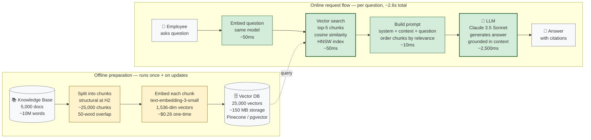

# The Librarian Who Never Forgets

There's a librarian. Let's call her Marta.

Marta has a peculiar condition: she cannot remember anything. Not her own name, not what she had for breakfast, not the book you asked about thirty seconds ago. Her memory is a sieve.

But Marta has a superpower. She can walk into the library — any library — and find any book in seconds. She knows exactly which shelf, which row, which volume. She can pull the right book for any question, open it to the right page, and read you the relevant paragraph. Then immediately forget she did it.

If you ask Marta a question, here's what she does:

1. She walks into the library.
2. She pulls the three or four books most likely to contain the answer.
3. She opens them, finds the relevant pages, and lays them out on the desk.
4. She reads the pages, thinks out loud, and answers your question.

That's it. That's the whole trick. Marta isn't smart because she *knows* things. She's smart because she can *find* things, and she can read.

**This is RAG.**

---

## Remember — name it

**RAG** stands for **Retrieval-Augmented Generation.** It's a pattern for using an LLM (a language model — Marta) on top of a knowledge base (the library) that the LLM doesn't have memorized.

The three words in order:

- **Retrieval** — find the relevant documents. Marta walks into the library and pulls books.
- **Augmented** — stuff those documents into the LLM's prompt. Marta lays the open books on the desk in front of her.
- **Generation** — the LLM reads the prompt (including the retrieved documents) and produces an answer. Marta reads the pages and answers your question.

The term was coined by Lewis et al. (Facebook AI Research) in their 2020 paper "Retrieval-Augmented Generation for Knowledge-Intensive NLP Tasks" (NeurIPS 2020). The original paper framed RAG as a way to let seq2seq models access external knowledge without retraining. Six years later, RAG has become the default pattern for building LLM applications on private data — but the core insight hasn't changed.

A few more words you'll need:

- **Embedding** — a numerical representation of text as a vector — a list of numbers, typically 768 to 3,072 dimensions depending on the model. Texts with similar meanings get similar vectors. The "GPS coordinates of meaning" — "dog" and "puppy" are close together on the map, "dog" and "chainsaw" are far apart. Produced by embedding models like OpenAI's `text-embedding-3-small` (1,536 dims), `text-embedding-3-large` (3,072 dims), or open-source alternatives like `bge-large-en-v1.5` (1,024 dims).
- **Vector database** — a database optimized for storing and searching embeddings. The library's catalog, organized not by title or author but by meaning. Options: Pinecone (managed), Weaviate (open-source), Qdrant (open-source, Rust), Milvus (open-source, scales to billions), or `pgvector` (Postgres extension — use if you're already on Postgres).
- **Chunk** — a piece of a document, the unit of retrieval. We don't retrieve whole books; we retrieve chapters or pages. Marta pulls the relevant *pages*, not the whole book. Typical chunk size: 200-800 words.
- **Prompt** — the text we hand the LLM. Includes instructions ("answer only from the context"), the user's question, and the retrieved chunks. A typical RAG prompt is 2,000-10,000 tokens.
- **Context window** — how much text the LLM can hold in mind at once. Marta's desk — it can only fit so many open books. GPT-4o: 128K tokens. Claude 3.5 Sonnet: 200K. Gemini 1.5 Pro: 1M+. Bigger desks, but still finite — and quality can degrade with very long contexts (the "lost in the middle" problem, Liu et al. 2023).
- **Hallucination** — when an LLM confidently states something false. Not a bug — a feature of how LLMs work (they predict plausible text, not true text). The primary thing RAG is trying to mitigate. The Air Canada chatbot incident (2024), where a chatbot hallucinated a refund policy and a Canadian court held the airline responsible, is the canonical cautionary tale.
- **Semantic search** — finding documents by meaning, not by keyword match. "How do I unlock my account?" matches "account recovery procedure" even though no words overlap — because their embeddings are similar.
- **Reranking** — a second-pass scoring step: retrieve many candidates cheaply (vector search), then score them precisely with a more expensive model. The librarian first flips through 50 books quickly, then carefully reads the 10 most promising.
- **RAGAS** — a framework for evaluating RAG systems (Es et al., 2023). Measures faithfulness, answer relevance, context precision, context recall. The tool that tells you whether your RAG system is actually good, not just whether it "sounds right."

That's the vocabulary. Now let's understand why RAG exists at all.

---

## Understand — why RAG exists

An LLM, on its own, is Marta without the library.

It has a vast amount of knowledge baked into its weights during training — the equivalent of having read the entire internet once, at a specific point in time. But that knowledge has three problems:

**Problem 1: it's frozen in time.** The LLM doesn't know anything that happened after its training cutoff. Claude 3.5 Sonnet's training data goes to April 2024. GPT-4o's goes to October 2023. If you ask "who won the 2026 election?" the model might confidently give you a wrong answer, because in *its* memory, the election hasn't happened yet — or it did, but the model is hallucinating the outcome based on patterns from past elections.

**Problem 2: it doesn't know your private stuff.** The LLM has never seen your company's HR handbook. It has never seen your customer's support tickets. It has never seen your codebase. Asking it "what's our refund policy?" is asking Marta a question about a book she's never read. The model will either say "I don't know" (good) or hallucinate a plausible-sounding policy (bad — potentially very bad, as Air Canada discovered).

**Problem 3: it hallucinates.** When an LLM doesn't know something, it doesn't say "I don't know." It generates plausible-sounding text that may or may not be true. This is a feature of how LLMs work (they predict plausible text, not true text — they're trained on next-token prediction, not on factuality). It's the single biggest reason people don't trust them in production. A hallucination in a chatbot is embarrassing. A hallucination in a medical AI is dangerous. A hallucination in a legal AI is a liability.

RAG solves all three problems.

- **Time:** retrieve the latest documents, hand them to the LLM, ask the question. The LLM answers from *current* sources, not from its stale training data.
- **Private data:** retrieve from your own knowledge base. The LLM answers from *your* documents, not from its training data's guess at what your documents might say.
- **Hallucination:** if the prompt includes the relevant documents and instructs the LLM to "answer only from the provided context," the LLM is *grounded* — it's reading from the page, not inventing. Hallucinations don't disappear, but they drop dramatically. The model can still misread the page or make faulty inferences, but it's no longer making things up from whole cloth.

**The deeper pattern:** RAG isn't a trick. It's a *separation of concerns*. The LLM is good at reading and reasoning. It's bad at memorization and factuality. RAG splits the job: the knowledge base handles memory (storing the documents, finding the right ones), the LLM handles reasoning (reading the retrieved documents, synthesizing an answer). Each does what it's good at.

This is the same insight as the candidate-generation-then-ranking split in recommendation systems (chapter A.2). Big AI systems are almost always *pipelines*, not single models. The art is in knowing where to draw the lines — which component does what, and how they hand off to each other.

---

## Apply — design a RAG system for a company's internal support bot

Let's design a real system. Employees ask "how do I reset my password?" and the bot answers from the company's IT wiki.

**The setup:** 5,000 wiki pages, average 2,000 words each (about 10 million words total). Employees ask ~100 questions per day. Budget: 5 seconds end-to-end per question. The system needs to be accurate (employees will lose trust fast if it gives wrong answers) and affordable (this is an internal tool, not a revenue-generating product — the budget is tight).

### Step 1: Chunking (offline, done once + on updates)

We don't retrieve whole pages — they're too big to fit in the context window (a 2,000-word page is ~2,600 tokens, and we might want to retrieve 5-10 pages), and most of a page is irrelevant to most questions. If an employee asks "how do I reset my password," they don't need the entire 50-page IT handbook — they need the paragraph about password resets. We split each page into chunks.

How? A few options, each with tradeoffs:

**Fixed-size chunking (every 500 words):** Simple, fast, brittle. Splits sentences mid-thought. "To reset your password, click the 'Forgot Password' link on the" might be one chunk; "login page, then enter your email" the next. A query about password reset matches both, but neither is self-contained. The LLM sees fragments, not instructions. Rarely the production choice, but a useful baseline.

**Sentence-aware chunking (split at sentence boundaries, target ~500 words):** Better — no split sentences. But still semantic-blind: a 500-word chunk might span three unrelated topics ("Password Reset" → "Email Setup" → "VPN Configuration") if the wiki author didn't use clear headings.

**Structural chunking (split at headings — H2, H3):** Best when documents are well-structured. A wiki page's H2 sections usually map to topics ("Account Security," "Password Reset," "SSO Setup"). Each chunk maps to a semantic unit the author intended. This is the production choice for most documentation, wikis, and structured content.

**Semantic chunking (split when the meaning changes):** Use embeddings to detect topic boundaries — embed each sentence, compare adjacent sentences, split when similarity drops below a threshold. Good for unstructured text (transcripts, long-form articles). More expensive (requires embedding each sentence and computing similarities), but produces the most semantically coherent chunks.

For our wiki: **structural chunking at H2 boundaries, with 50-word overlap between adjacent chunks.** The overlap ensures that a chunk ending mid-idea gets continued in the next one, so a query matching either chunk retrieves the complete idea. Average chunk: ~400 words. Total chunks: ~25,000 (5,000 pages × ~5 chunks each).

The overlap matters more than beginners expect. If chunk N ends with "To reset your password, click the 'Forgot Password' link on the" and chunk N+1 begins with "login page, then enter your email," a query about "how to reset password" might match either chunk — but only the combined version is useful. Overlap ensures partial matches don't lose context. 50-100 words of overlap is typical; too much overlap wastes context window space, too little loses boundary context.

### Step 2: Embedding (offline, done once, redone when wiki updates)

Each chunk gets embedded — converted to a vector. We use an embedding model. As of 2026, common choices:

- **OpenAI `text-embedding-3-large`** — 3,072 dimensions, ~$0.13 per 1M tokens (as of August 2026). High quality, expensive.
- **OpenAI `text-embedding-3-small`** — 1,536 dimensions, ~$0.02 per 1M tokens. The cost-effective default for most use cases. Strong benchmark performance.
- **`bge-large-en-v1.5`** (BAAI) — 1,024 dimensions, open-source, self-hostable. Strong benchmark performance, free if you have GPU capacity.
- **`bge-m3`** (BAAI) — multilingual, 1,024 dimensions. Use if your corpus is not English-only.
- **Cohere `embed-english-v3.0`** — 1,024 dimensions, ~$0.10 per 1M tokens. Good for English-only, with a different training methodology.

For our wiki: `text-embedding-3-small`. Cost calculation: 25,000 chunks × ~400 words × ~1.3 tokens/word ≈ 13M tokens. Embedding cost: 13M × $0.02/1M = $0.26. One-time. Absurdly cheap. This is why RAG is economically viable — the embedding cost is negligible compared to the LLM inference cost.

The 25,000 vectors (each 1,536 numbers) go into a vector database. Storage: 25,000 × 1,536 × 4 bytes = ~150 MB. Fits in memory on a single machine; also fits comfortably in any managed vector DB.

### Step 3: Retrieval (online, ~200ms per query)

When an employee asks "how do I reset my password?":

1. **Embed the question** using the same embedding model. (One API call, ~50ms.) This produces a 1,536-dimension vector representing the question's meaning.
2. **Search the vector database** for the top-K most similar chunks. (K=5 is a reasonable default. ~50ms with HNSW indexing.) The search uses cosine similarity — it finds the chunks whose vectors are closest to the question vector.
3. **Return those 5 chunks**, with their text, their similarity scores, and their metadata (source page, section, last-updated date).

The search is *approximate* — it uses approximate nearest neighbor (ANN) algorithms (HNSW, IVF) that find *roughly* the closest vectors without comparing against all 25,000. This is the foundational tradeoff of vector search: exactness for speed. HNSW with default parameters finds ~95% of the true top-5. For RAG, this is fine — the 5% miss rate has minimal impact on answer quality, because the top results are usually so much more relevant than the rest that missing one doesn't matter.

### Step 4: Augmentation (online, ~10ms)

Build the prompt:

```
You are an internal IT support assistant. Answer the user's question
using only the provided context. If the context doesn't contain the
answer, say "I don't know" — do not make up an answer.

Context:
[chunk 1: from "Account Security" page, section "Password Reset", 
 similarity 0.91, last updated 2026-07-15]
"To reset your password, click the 'Forgot Password' link on the 
login page, then enter your email address. You'll receive a reset 
link within 5 minutes."

[chunk 2: from "Password Reset" page, section "Troubleshooting", 
 similarity 0.88, last updated 2026-06-20]
"If you don't receive the reset email, check your spam folder. 
If it's not there, contact IT support at ext. 4500."

[chunk 3: from "SSO Setup" page, section "Overview", 
 similarity 0.72, last updated 2026-05-01]
"Single Sign-On (SSO) allows you to access multiple applications..."

[chunk 4: from "Account Recovery" page, section "Locked Accounts", 
 similarity 0.69, last updated 2026-07-01]
"If your account is locked after 5 failed login attempts..."

[chunk 5: from "Mobile Device Setup" page, section "Password Sync",
 similarity 0.61, last updated 2026-04-15]
"To sync your password to your mobile device..."

User question: how do I reset my password?
```

Notice several things about this prompt:

1. **The instruction is explicit:** "answer only from the context" and "if the context doesn't contain the answer, say I don't know." This grounding instruction is what prevents hallucination. Without it, the LLM might draw on its training data (which could contain outdated or wrong password reset procedures).
2. **The chunks include metadata:** source page, section, similarity score, last-updated date. This lets the LLM reason about provenance ("according to the Account Security page, updated July 2026...") and lets the user verify the answer.
3. **The chunks are ordered by similarity** (0.91, 0.88, 0.72, 0.69, 0.61). This matters because of the "lost in the middle" problem (Liu et al., 2023) — LLMs pay more attention to the beginning and end of the context. Put the most relevant chunks first and last, not in the middle.
4. **Chunk 3 is probably irrelevant** (similarity 0.72, about SSO, not password reset). This is normal — vector search returns the top-K even if some are not actually relevant. The LLM is expected to ignore irrelevant chunks. If too many irrelevant chunks appear, you need better retrieval (see the "reranking" section below).

### Step 5: Generation (online, ~2-3 seconds)

Send the prompt to the LLM. It reads the context, reads the question, and generates the answer. The answer is grounded in the retrieved chunks — the LLM is reading from the page, not inventing.

**Total latency:** ~50ms (embed query) + ~50ms (vector search) + ~10ms (build prompt) + ~2,500ms (LLM generation with Claude 3.5 Sonnet) = ~2.6 seconds. Comfortably under the 5-second budget.

**Cost per query:** Input tokens: ~2,000 (system prompt + context + question). Output tokens: ~200 (the answer). With Claude 3.5 Sonnet at $3/1M input + $15/1M output: (2,000 × $3/1M) + (200 × $15/1M) = $0.006 + $0.003 = $0.009 per query. At 100 queries/day: $0.90/day, ~$27/month. Sustainable for an internal tool.

Here's the full pipeline:



Yellow = offline preparation. Green = online request flow. The offline pipeline runs once (and again whenever the wiki updates). The online pipeline runs per question.

---

## Analyze — where RAG breaks

RAG looks simple in the diagram. It is not simple in practice. Here's where it breaks — and these failure modes are where most RAG debugging time goes.

### Break #1: retrieval quality is the bottleneck

This is the most important thing to understand about RAG, and most beginners miss it: **if retrieval misses the right chunk, generation cannot recover.** The LLM can only read what's on the desk. If Marta pulls the wrong books, no amount of reading skill will produce the right answer.

This means RAG debugging is *mostly retrieval debugging*. When the bot gives a wrong answer, the question isn't "why did the LLM hallucinate?" — it's "did we retrieve the right chunks?" Usually, no.

Common retrieval failure modes:

- **Chunk too small:** the chunk doesn't contain enough context for the embedding to capture its meaning. An embedding of "Click the link to continue." is nearly meaningless — it could be about anything. The embedding averages over too little text.
- **Chunk too big:** the chunk contains the answer buried in irrelevant text. The embedding averages over too much meaning and matches the wrong queries. A 2,000-word chunk about "Account Security" might match any security-related query, even if the specific answer is in paragraph 17.
- **Vocabulary mismatch:** the user asks "how do I unlock my account?" but the wiki says "account recovery." Embeddings usually bridge this gap (they capture semantic similarity, not just word overlap), but not always — especially for domain-specific jargon. "Unlock" and "recovery" are semantically related but not identical.
- **Multi-hop questions:** "what's the difference between our password reset process for employees vs. contractors?" requires retrieving *two* chunks (one about employee reset, one about contractor reset) and synthesizing. Single-query retrieval gets one or the other, rarely both. This is an active research area — see Khattab et al. (2022), "ReAct: Synergizing Reasoning and Acting in Language Models," which introduces a hybrid retrieval + reasoning pattern where the LLM decides what to retrieve next based on what it's already found.

### Break #2: the context window is not infinite

You can't retrieve 100 chunks and stuff them all in. The LLM has a context window. Stuff too much in, and:

- You hit the limit and the LLM truncates your prompt (silently — the API just drops the end).
- The LLM's attention degrades — it pays less attention to content in the middle of long contexts. This is the **"lost in the middle" problem**, documented by Liu et al. (2023, "Lost in the Middle: How Language Models Use Long Contexts," Transactions of the Association for Computational Linguistics). Their finding: models perform best when relevant information is at the *beginning* or *end* of the context, and worst when it's in the *middle*. This has direct implications for how you order retrieved chunks: put the most relevant at the start and end, not in the middle.
- Cost goes up — you pay per token, both for the prompt and (for some providers) for the KV cache computation. A 10,000-token prompt costs 5x more than a 2,000-token prompt, and if the extra tokens are irrelevant, you're paying for noise that degrades quality.

### Break #3: the LLM ignores the context

Even with the right chunks in the prompt, the LLM might:

- **Hallucinate anyway**, especially if the question is similar to something in its training data. If the user asks "what's our refund policy?" and the LLM's training data included generic e-commerce refund policies, the model might ignore your specific retrieved policy and recite the generic one. This is the "prior knowledge overrides retrieved context" failure.
- **Misread the chunks**, especially if they're technical, dense, or use unfamiliar terminology. Legal and medical text is particularly hard — the words have precise meanings that the LLM might not capture.
- **Refuse to answer** if the chunks are ambiguous or if the system prompt is too cautious. An over-cautious system prompt ("never give specific advice") can cause the LLM to refuse even when the retrieved context has the exact answer.

### Break #4: stale data

The wiki updates. The vector database doesn't automatically. If someone updates the password-reset procedure on Monday and the vector DB was last embedded on Sunday, the bot will give the *old* procedure on Tuesday — confidently, because the chunk it retrieved *was* the right one, just out of date.

The fix is a *re-embedding pipeline*: when the wiki updates, re-embed the affected chunks and update the vector DB. Easy to say; surprisingly fiddly to operate at scale. Production systems usually combine: webhook-triggered re-embedding for real-time updates (when a page is edited, trigger re-embedding of that page's chunks), plus a nightly full re-embed as a safety net (in case the webhook missed something).

---

## Evaluate — the chunking tradeoff

The single highest-leverage decision in a RAG system is **how you chunk.** It's also the most under-discussed — most tutorials say "use 500-word chunks" and move on, as if that's the answer.

*Small chunks (100-200 words):*

- Pros: each chunk has a tight, specific meaning. Embeddings are precise — the vector captures exactly what the chunk is about. You can fit more chunks in the context window (10 chunks of 200 words = 2,000 tokens; 10 chunks of 800 words = 8,000 tokens).
- Cons: chunks may not contain enough context to be self-contained. The LLM sees fragments, not whole ideas. Multi-sentence reasoning breaks. "Click the link to continue" is meaningless without knowing what link and what continues.

*Large chunks (1,000-2,000 words):*

- Pros: each chunk is self-contained. The LLM sees complete reasoning, full procedures, entire sections. Less risk of missing context.
- Cons: embeddings average over too much meaning. A 1,500-word chunk about "Account Security" might match any security-related query, even if the specific answer is in paragraph 12. You can fit fewer chunks in the context window. The LLM has to scan more text to find the answer.

*Structural chunks (split at headings):*

- Pros: chunks map to the document's natural semantic boundaries. Self-contained by design — the author created the headings for a reason.
- Cons: depends on the document being well-structured. A wall-of-text document with no headings gets one giant chunk. Some headings are too long (a 3,000-word section), some too short (a 50-word note).

**The pattern:** there is no universal best chunk size. There's the best chunk size *for your documents, your queries, and your model*. You find it by:

1. Building a small evaluation set (50-100 questions with known-correct answers, drawn from real user queries — not synthetic).
2. Trying chunk sizes 200, 500, 1,000, and structural.
3. Measuring retrieval recall (did the right chunk appear in the top-5?) and answer correctness (did the LLM's answer match the known-correct answer?).
4. Picking the winner.

This is system design as empiricism, again. You don't reason your way to the right chunk size. You measure your way there. But you have to know *that chunk size matters* and *why* — otherwise you'll spend weeks tuning the LLM prompt and never touch the actual bottleneck.

### Evaluation: how do you know your RAG system is good?

This is harder than it looks. "It sounds right" isn't good enough — that's the failure mode of chapter B.8. Real RAG evaluation uses frameworks like **RAGAS** (Es et al., 2023, "RAGAS: Automated Evaluation of Retrieval Augmented Generation," arXiv:2309.15217) or **TruLens**, which measure:

- **Faithfulness:** is the answer grounded in the retrieved context? (Detects hallucination — did the LLM say something that isn't in the chunks?)
- **Answer relevance:** does the answer actually address the question? (Detects "the answer is grounded but irrelevant" — the LLM answered a different question than the one asked.)
- **Context precision:** were the retrieved chunks relevant? (Measures retrieval quality — did we retrieve the right chunks?)
- **Context recall:** did we retrieve the chunks needed to answer? (Measures retrieval completeness — did we miss any chunks that contained the answer?)

These metrics let you iterate on chunking, embedding, and retrieval *without* a human in the loop for every change. Build the eval set once (50-100 questions with known-correct answers); run it on every change to the pipeline. If faithfulness drops, you might have a prompt issue. If context precision drops, you might have a chunking or embedding issue. If context recall drops, you might need to retrieve more chunks or use a different embedding model.

---

## Create — design a RAG system for a legal research bot

You're building a tool for lawyers. They ask questions like "what's the statute of limitations on product liability claims in California?" and the bot answers from a corpus of state statutes and case law.

Sketch the system. Consider:

- The corpus is huge (millions of documents) and structured (statute → section → subsection, case → holdings → dicta). How does that shape your chunking? (Structural chunking at the subsection level, with metadata for jurisdiction, statute number, and effective date.)
- Some queries need *current* law (the 2026 statute), some need *historical* law (the law as it stood in 2019, for a case being litigated). How do you handle time? (Metadata filtering by effective date; store multiple versions of each statute.)
- Lawyers will not tolerate hallucination. How do you make the bot say "I don't know" reliably? (Strong system prompt, eval suite with known-correct citations, confidence threshold below which the bot refuses.)
- Citations matter — every claim must point to the specific statute and section it came from. How do you preserve provenance through the pipeline? (Each chunk carries metadata: source document, section, jurisdiction, effective date. The prompt instructs the LLM to cite the source for each claim.)
- What's your fallback when retrieval returns no high-confidence chunks? (Refuse to answer — "I couldn't find relevant statutes in the corpus" — don't hallucinate.)

There's no "correct" answer. There's the answer *you* would defend, with reasons, in a design review with actual lawyers.

---

## A common misconception

**"RAG = 'search the docs and stuff them into the prompt.'"**

This is the most common simplification of RAG, and it hides everything that matters.

The simplification treats RAG as a single step: search → stuff → generate. In reality, RAG is a *pipeline* with at least five stages (chunk, embed, retrieve, augment, generate), each with its own design decisions, failure modes, and tradeoffs.

The simplification also hides *where the quality comes from*. "Search the docs" implies the search is the easy part and the LLM is the hard part. In practice, it's the opposite: the LLM is a commodity (any frontier model will do — Claude, GPT-4, Gemini all give similar quality on well-retrieved context), and the retrieval pipeline is where 90% of the quality lives. The teams that win at RAG are the teams that obsess over chunking, embedding, reranking, and evaluation — not the teams that switch from GPT-4 to Claude and call it a day.

Finally, the simplification hides the engineering. "Stuff them into the prompt" implies a static operation. In practice, the augmentation step involves:

- Choosing how many chunks to include (context budget — more chunks = more context but higher cost and potential quality degradation).
- Ordering them (per the "lost in the middle" finding, the most relevant should be at the *start* and *end* of the context, not the middle).
- Compressing them (some systems summarize chunks before stuffing, to fit more relevant information in the context window).
- Adding metadata (source, date, confidence) so the LLM can reason about provenance and the user can verify the answer.

RAG is a system, not a trick. Treat it as a system, and you'll build something that works. Treat it as a trick, and you'll ship a demo that breaks the first time a user asks a question that wasn't in your test set.

---

## Explain it back

Close the laptop. Out loud, in your own words:

> "RAG stands for _____. The reason it exists is that LLMs have three problems: _____, _____, and _____. RAG solves them by _____. The pipeline has (at least) five stages: _____, _____, _____, _____, and _____. The single most important thing to understand about RAG is that _____ is the bottleneck, because if _____, then _____, no matter how good the LLM is. One specific failure mode I'm now aware of is _____, and a fix for it is _____. The 'lost in the middle' problem is _____, and it affects how I order retrieved chunks by _____. A real production system that uses RAG would cost approximately $___ per query with Claude 3.5 Sonnet."

If you can fill those blanks in your own words, you understand RAG. If you can't, re-read "Understand" and "Apply."

---

## Further reading

This chapter is self-contained, but if you want to go deeper:

- **Lewis, P., et al. (2020), "Retrieval-Augmented Generation for Knowledge-Intensive NLP Tasks," NeurIPS.** The paper that coined RAG. Read the introduction and Section 3. The original framing was about letting seq2seq models access external knowledge; the modern framing is broader. https://arxiv.org/abs/2005.11401
- **Gao, Y., et al. (2023), "Retrieval-Augmented Generation for Large Language Models: A Survey," arXiv:2312.10997.** A comprehensive survey of RAG techniques as of late 2023. The taxonomy is useful for understanding the landscape.
- **Liu, N. F., et al. (2023), "Lost in the Middle: How Language Models Use Long Contexts," TACL.** The empirical finding that LLMs pay less attention to content in the middle of long contexts. Directly affects how you order retrieved chunks.
- **Khattab, O., et al. (2022), "ReAct: Synergizing Reasoning and Acting in Language Models," ICLR.** The multi-step retrieval + reasoning pattern for complex questions. Not just retrieve-once-generate, but a loop of retrieve → reason → retrieve more → reason → answer.
- **Karpukhin, V., et al. (2020), "Dense Passage Retrieval for Open-Domain Question Answering," EMNLP.** The DPR paper, foundational for bi-encoder retrieval. The technique that made dense retrieval practical.
- **Es, S., et al. (2023), "RAGAS: Automated Evaluation of Retrieval Augmented Generation," arXiv:2309.15217.** A practical evaluation framework for RAG systems. Use it to measure faithfulness, answer relevance, context precision, and context recall. https://github.com/shahules786/ragas
- **Malkov, Y. A., & Yashunin, D. A. (2020), "Efficient and robust approximate nearest neighbor search using Hierarchical Navigable Small World graphs," IEEE TPAMI 42(4).** The HNSW algorithm that powers most production vector databases. (arXiv preprint: arXiv:1603.09320, 2016)
