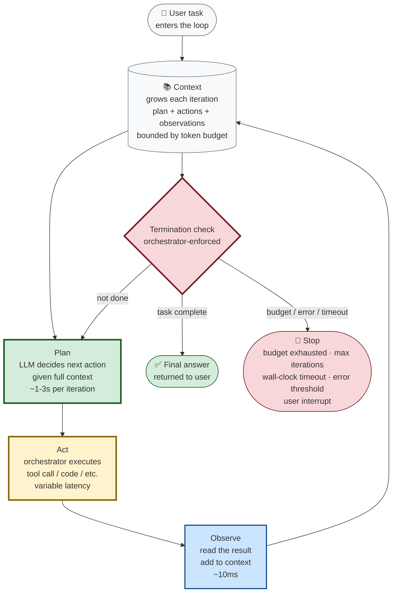

# The Loop That Won't Stop

Picture a junior employee. Let's call him Devon.

You hand Devon a task: "Find out why our signup conversion dropped 12% last week, and write a one-page summary for the exec meeting on Thursday."

Devon doesn't just *answer* — he's not a chatbot. He *works*. He:

1. **Plans**: "Okay, I need to look at signup analytics, compare to last week, identify where the drop is, figure out why, and write it up."
2. **Acts**: He opens the analytics dashboard. He pulls the numbers. He compares them to the prior week. He notices the drop is concentrated on mobile.
3. **Observes**: "Mobile signups dropped 30%. Desktop is flat. Something's wrong with mobile signup."
4. **Plans again**: "I need to check if there was a mobile deploy last week. Let me look at the release log."
5. **Acts again**: Opens the release log. Sees a new mobile signup form shipped Tuesday.
6. **Observes again**: "Tuesday deploy. Drop started Wednesday. Correlation."
7. **Plans again**: "I should talk to the mobile engineer who shipped it."
8. **Acts again**: Slacks the engineer. Gets a reply: "Oh — we added a captcha step. Maybe that's friction."
9. **Observes again**: "Captcha added Tuesday. Drop started Wednesday. Likely cause."
10. **Plans again**: "I have enough. Time to write the summary."
11. **Acts again**: Writes the one-page summary.
12. **Observes again**: Reads it over. Looks good.
13. **Done.** Hands it to you.

Notice what Devon did. He didn't answer your question in one shot. He worked in a **loop**: plan → act → observe → repeat, until the task was done. Each step fed the next. Each observation reshaped the plan. The loop terminated when the task was complete (or when you told him to stop, or when he ran out of time).

**That loop is what makes something an agent.** Not the LLM. Not the tools. The loop.

This chapter is about that loop. By the end, you should be able to describe it precisely, name the termination conditions, and design the *budget problem* — the part that determines whether your agent is a useful employee or a runaway one.

---

## Remember — name it

- **Agent** — an AI system that takes actions in the world, not just produces text. Devon, not a chatbot. The distinction is action: a chatbot tells you how to book a flight; an agent books the flight.
- **Agent loop** — the core pattern: plan → act → observe → repeat, until done or until budget exhausted. The thing that makes an agent an agent.
- **Plan** — decide what to do next, given everything observed so far. The LLM's main job in an agent. This is where reasoning happens.
- **Act** — execute the plan: call a tool, run code, query a database, send a message. Often the most expensive step (tool calls may cost money or take time).
- **Observe** — read the result of the action, add it to the context, decide whether the task is done or needs another loop. The feedback that feeds the next plan.
- **Tool** — a function the agent can call. "Search the web," "run SQL," "send a Slack message," "open a URL." Tools are the agent's hands.
- **Termination condition** — what makes the loop stop. "Task is complete," "budget exhausted," "maximum iterations reached," "user interrupted," "error threshold exceeded." The most under-designed part of most agents.
- **Budget** — the cap on resources: number of iterations, total tokens consumed, total dollars spent, wall-clock time. The kill switch. Without a budget, an agent is a process you can't stop.
- **Context** — everything the agent has seen so far. The plan, all actions taken, all observations. This grows with each loop iteration, eventually hitting the LLM's context window limit.
- **Orchestrator** — the code that runs the loop, calls the LLM, executes tools, enforces the budget. *Not* the LLM itself. The orchestrator is the kill switch — the LLM cannot be trusted to enforce its own budget.

Hold those loosely. The four you really need: plan, act, observe, terminate. Everything else is variation.

---

## Understand — explain it in plain words

An agent is **not** just an LLM that can call functions. That's a common simplification, and it hides the most important part.

An agent is an LLM **embedded in a loop**, where each iteration of the loop:

1. **Feeds the LLM everything observed so far** (the context).
2. **Asks the LLM to decide what to do next** (the plan).
3. **Executes that decision** (the act — which may be a tool call, or may be "I'm done, here's the answer").
4. **Adds the result to the context** (the observation).
5. **Checks whether to terminate** (done? budget exhausted? error?).

If termination: return the final answer. If not: loop.

This pattern has a name in the literature: **ReAct** (Reasoning + Acting), introduced by Yao et al. (2022, "ReAct: Synergizing Reasoning and Acting in Language Models," ICLR 2023). The paper's insight was that LLMs perform better on multi-step tasks when they *interleave* reasoning ("I should check the release log because the drop started Tuesday and there was a deploy that day") with acting (calling the release-log tool), rather than trying to reason through everything in one shot. The loop isn't just an implementation detail — it's the cognitive architecture.

Here's the loop, drawn:



Green = LLM thinking (the "plan" step). Yellow = tool execution (the "act" step, run by the orchestrator). Blue = context update (the "observe" step). Red = the termination check — the most important and most under-designed part of any agent.

**The reason this matters:** without the loop, you have a chatbot. With the loop, you have something that can do *work* — multi-step, stateful, adaptive work that no single LLM call could accomplish.

Devon couldn't have written the exec summary in one shot. He needed to look at analytics, notice the mobile concentration, check the release log, talk to the engineer. Each step depended on the previous. The loop is what made the work possible.

But the loop is also what makes agents *dangerous*. A loop that won't stop is a runaway process. We'll come back to this.

---

## Apply — design a research agent

Let's design a real agent. The setup: a "research agent" that takes a question, searches the web, reads sources, and writes a cited summary.

**The task:** "Is the global semiconductor shortage expected to ease in 2026?"

**The tools available to the agent:**

- `web_search(query)` — returns a list of URLs and snippets. Calls a search API (Google, Bing, or SerpAPI). Cost: ~$0.001 per call.
- `fetch_page(url)` — returns the full text of a webpage. Uses a headless browser or HTTP fetch. Cost: minimal, but latency can be 1-5 seconds.
- `write_summary(text)` — appends to the running summary document.
- `finish(summary)` — terminates the loop and returns the final answer.

**The context (initial):**

```
System: You are a research agent. Your job is to answer the user's
question by searching the web, reading sources, and writing a cited
summary. Use the tools available to you. When you have enough
information, call `finish` with your summary.

You have a budget of 15 iterations and $5.00 in LLM costs. Plan
accordingly — if you're running low on budget, prioritize writing
the summary over gathering more sources.

User: Is the global semiconductor shortage expected to ease in 2026?
```

Notice the explicit budget in the system prompt. The LLM needs to know the budget to plan around it. This is not optional — an agent that doesn't know its budget can't make tradeoffs ("should I do one more search, or write the summary now?").

**Iteration 1:**

- **Plan:** The LLM decides: "I should search the web for recent reports on the semiconductor shortage in 2026."
- **Act:** Call `web_search("semiconductor shortage 2026 forecast")`.
- **Observe:** Tool returns 10 URLs, including a Reuters article, an industry analyst report, and a Bloomberg piece.
- **Check:** Task done? No — we have search results, but haven't read them. Budget exhausted? No. Continue.

**Iteration 2:**

- **Plan:** "I should read the Reuters article and the analyst report — those seem most credible."
- **Act:** Call `fetch_page(url_reuters)` and `fetch_page(url_analyst)`.
- **Observe:** Tool returns the text of both articles. The Reuters article says demand is stabilizing; the analyst report predicts modest supply improvements in H2 2026.
- **Check:** Done? Maybe — but the agent might want one more source for balance. Continue.

**Iteration 3:**

- **Plan:** "I have two sources. Let me get one more for balance — maybe a counterpoint."
- **Act:** Call `web_search("semiconductor shortage 2026 risks")`.
- **Observe:** Returns a third source — a piece about geopolitical risks that could disrupt supply again.
- **Act:** Call `fetch_page(url_risks)`.
- **Observe:** Article lists three risk factors: Taiwan tensions, export controls, demand spikes from AI.
- **Check:** Done? Yes — three balanced sources, enough to write a summary.

**Iteration 4:**

- **Plan:** "I have enough. Time to write the summary."
- **Act:** Call `write_summary(...)` with a draft. Then call `finish(summary)`.
- **Observe:** Loop terminates.
- **Final answer:** A one-page summary with three citations.

### The five termination conditions

A well-designed agent has *multiple* termination conditions, layered like defense in depth:

1. **Task complete** — the LLM explicitly calls `finish()`. The happy path. The LLM decides it's done.
2. **Maximum iterations** — hard cap, e.g., 15. Prevents infinite loops. Enforced by the orchestrator.
3. **Budget exhausted** — hard cap on tokens or dollars. Prevents runaway costs. Enforced by the orchestrator.
4. **Wall-clock timeout** — hard cap on elapsed time. Prevents stuck agents from blocking the user. Enforced by the orchestrator.
5. **Error threshold** — if the agent hits N consecutive tool errors, terminate. The agent is probably stuck in a bad state. Enforced by the orchestrator.
6. **User interrupt** — the user (or a supervisor) manually stops the agent. The "pause button" that must always exist. Enforced by the orchestrator.

Notice that only #1 is the LLM's decision. Conditions #2–#6 are enforced by the **orchestrator** — the code that runs the loop. The LLM cannot be trusted to enforce its own budget. This is the most important architectural principle of agent design: **the orchestrator is the kill switch, not the LLM.**

If you remember one thing from this chapter, remember that. The LLM is the brain; the orchestrator is the leash. A brain without a leash is a runaway process. A leash without a brain is a no-op. You need both.

---

## Analyze — the failure modes

Agents fail in characteristic ways. Knowing them is half the battle — the other half is designing guardrails (chapter C.5) to prevent them.

### Failure #1: the loop that won't stop

The LLM keeps searching, never deciding it has enough. Each iteration adds a new source, but the LLM is never confident enough to call `finish`. The loop runs until the budget is exhausted, then returns whatever it has — usually worse than if it had stopped three iterations earlier.

*Why it happens:* LLMs are biased toward continuation. "Maybe one more search will be better" feels safer than "I'm done." Without an explicit termination signal, the default behavior is to keep going. This is amplified by the fact that LLMs are trained on next-token prediction — they're literally trained to continue, not to stop.

*Fix:* explicit stopping rules. "After 5 sources, you must call `finish`." Or: "If the last search returned no new information (sources you've already read), call `finish` immediately." Make termination a first-class instruction, not a hope. Combine with the orchestrator's hard iteration cap as a backstop.

### Failure #2: the loop that stops too early

The opposite problem. The LLM calls `finish` after one search, with insufficient information. The summary is shallow or wrong.

*Why it happens:* LLMs are also biased toward satisfying the user quickly. The first plausible-looking answer feels like "done." This is especially common with smaller models (Haiku, 4o-mini) which have less ability to assess their own uncertainty.

*Fix:* explicit minimums. "You must use at least 3 sources before calling `finish`." Or: a separate "evaluator" step that scores the draft summary and only allows termination if the score is above a threshold. This is the **Reflexion** pattern (Shinn et al., 2023, "Reflexion: Language Agents with Verbal Reinforcement Learning," NeurIPS) — the agent reflects on its own output before committing. "Does this summary actually answer the question? Am I confident in the citations? If not, I should search more."

### Failure #3: the loop that drifts

The agent starts researching the semiconductor shortage, finds an interesting tangent about TSMC's new fab in Arizona, and ends up writing a summary about US-China trade policy. The original question is lost.

*Why it happens:* each observation reshapes the context, and the LLM's attention shifts to whatever's most salient. Without an anchor to the original task, the agent drifts. This is the LLM equivalent of a human going down a Wikipedia rabbit hole.

*Fix:* re-inject the original task at every iteration. The system prompt should say: "Remember: your task is [X]. Do not pursue tangents unless directly relevant to [X]." Some production agents also include a "task state" object that the LLM must update each iteration, forcing it to explicitly track progress: "What I've learned so far: ... What I still need: ... Am I on track for the original task?"

### Failure #4: the loop that errors silently

A tool call fails — `fetch_page` returns a 404, or `web_search` times out. The LLM doesn't notice, treats the empty result as "no information found," and proceeds with bad data. The final summary is confidently wrong — it says "no sources found on this topic" when actually the sources exist but the fetch failed.

*Why it happens:* tool errors are often returned as empty strings or generic error messages, which look like "no results" to the LLM. The LLM can't distinguish "the tool failed" from "the tool succeeded but found nothing."

*Fix:* make tool errors loud. Return structured error objects that the LLM is instructed to treat as "this source is unavailable, try a different one" rather than "this source confirms the absence of information." Log all tool errors to the orchestrator for observability. If a tool fails N times in a row, terminate with an error rather than continuing with degraded data.

### Failure #5: the loop that goes off-budget

Each iteration consumes tokens (the context grows). Each tool call may cost money (paid APIs, compute). Without explicit budgets, a single agent run can rack up $50 in LLM costs before anyone notices. This isn't hypothetical — in 2024, multiple companies reported runaway agent loops racking up five-figure bills, often when the agent got stuck in a "let me try one more search" loop with a paid search API.

*Why it happens:* the loop is unbounded by default. The LLM doesn't know how much it's spending. The orchestrator doesn't have a budget cap.

*Fix:* hard budgets, enforced by the orchestrator. "Maximum 15 iterations. Maximum 50,000 tokens. Maximum $5. Whichever is hit first, terminate." The LLM should be told the budget so it can plan accordingly, but the orchestrator enforces it regardless of what the LLM does. This is the kill switch — non-negotiable.

---

## Evaluate — the budget problem

The budget problem is the central tradeoff of agent design, and it has no closed-form solution.

**A generous budget (many iterations, high token cap, high dollar cap):**

- Pros: the agent can do thorough work. It can explore multiple sources, double-check findings, recover from dead ends. The quality ceiling is higher.
- Cons: expensive. Slow. The loop can run away before anyone notices. A single complex task could cost $50.

**A tight budget (few iterations, low token cap, low dollar cap):**

- Pros: cheap. Fast. Predictable. The cost per run is bounded.
- Cons: the agent may not have enough room to do the task. It stops mid-investigation, returning a half-finished answer. The quality floor is lower.

**The pattern:** the budget should be *calibrated to the task value*. A research agent writing a one-page summary for an exec meeting might be worth $5 of compute. An agent writing a 50-page market analysis might be worth $200. An agent running a stock trade might be worth $0.50 (and have hard wall-clock limits of 30 seconds — you can't wait minutes for a trade decision).

The mistake is to set the budget *once, globally* — "all agents get 10 iterations and $2." Different tasks have different value, and the budget should reflect that. A coding agent that takes 30 iterations to fix a bug might be worth $5 if the bug is blocking a deploy. A customer support agent that takes 30 iterations to answer "what are your hours?" is not worth $5 — that should have been 1 iteration.

The deeper mistake is to set the budget *without telling the LLM*. The LLM can't plan around a budget it doesn't know about. If it knows "you have $5 and 15 iterations," it can decide to skip the third search and write the summary now. If it doesn't know, it just keeps going until the orchestrator kills it — at which point the work-in-progress is lost, and the user gets a truncated or empty answer.

**The pattern, refined:** tell the LLM the budget. Enforce it in the orchestrator. Make the budget per-task, not global. Log every iteration so you can see, post-hoc, where the agent spent its budget. The agents that work well in production are the ones where the budget is a design parameter, not an afterthought.

### Real numbers — what agent runs actually cost

To make this concrete, here's what a typical agent run costs as of 2026, using Claude 3.5 Sonnet at $3/1M input + $15/1M output:

- **Simple Q&A agent** (1-3 iterations, no tools): ~$0.01-0.05 per run. Just an LLM call with some context.
- **Research agent** (5-15 iterations, web search + fetch): ~$0.10-0.50 per run. Each iteration adds ~2,000-5,000 tokens to the context (tool results are verbose).
- **Coding agent** (10-30 iterations, file reads + writes + test runs): ~$0.50-5.00 per run. Code is token-heavy, and test output can be long.
- **Complex multi-agent workflow** (multiple specialized agents, 50+ iterations total): ~$5-50 per run. Each agent has its own context, and coordination adds overhead.

These are rough order-of-magnitude estimates. Actual costs vary wildly based on context length, tool result size, and model choice. The point is: agent costs are *request-shaped*, not *user-shaped*. One power user running 100 complex agent workflows a day will cost more than 1,000 casual users running one simple Q&A each. This is the opposite of traditional SaaS, where infrastructure costs are roughly per-user. In AI, the cost is per-request, and requests vary by 1000x in complexity.

---

## Create — design a coding agent

You're building an agent that takes a bug report and produces a fix. The tools available:

- `read_file(path)` — read a file in the repo.
- `grep(pattern)` — search the codebase.
- `write_file(path, content)` — modify a file.
- `run_tests()` — run the test suite.
- `finish(diff, explanation)` — submit the fix.

Sketch the agent. Specifically:

- What's the system prompt? What rules do you give it? (Include the budget, the task scope, and the explicit termination conditions.)
- What's the budget? (Iterations, tokens, dollars, wall-clock.) How did you arrive at those numbers?
- What are the termination conditions? (Beyond "task complete" and "budget exhausted" — what about "tests pass" vs. "tests still failing after 5 attempts"?)
- What failure mode from the "Analyze" section are you most worried about, and how does your design mitigate it?
- How do you sandbox the `write_file` and `run_tests` tools? (An agent that can write files and run code can write *any* file and run *any* code. This is a security boundary, not just a feature.)

There's no correct answer. There's the answer you'd defend in a design review.

### A reference orchestrator (Python pseudocode)

To make this concrete, here's what a minimal orchestrator looks like:

```python
from dataclasses import dataclass
from typing import Optional

@dataclass
class Budget:
    max_iterations: int = 15
    max_tokens: int = 50_000
    max_dollars: float = 5.0
    max_wall_clock_seconds: int = 60
    max_consecutive_errors: int = 3

@dataclass
class AgentResult:
    status: str  # "complete", "budget_exhausted", "max_iterations", "error"
    output: Optional[str] = None
    iterations_used: int = 0
    tokens_used: int = 0
    cost: float = 0.0

def run_agent(task: str, budget: Budget) -> AgentResult:
    context = [build_system_prompt(task, budget)]
    tokens_used = 0
    cost = 0.0
    consecutive_errors = 0

    for iteration in range(budget.max_iterations):
        # Check budget
        if tokens_used > budget.max_tokens:
            return AgentResult("budget_exhausted", iterations_used=iteration, 
                             tokens_used=tokens_used, cost=cost)
        if cost > budget.max_dollars:
            return AgentResult("budget_exhausted", iterations_used=iteration,
                             tokens_used=tokens_used, cost=cost)
        if consecutive_errors >= budget.max_consecutive_errors:
            return AgentResult("error", iterations_used=iteration,
                             tokens_used=tokens_used, cost=cost)

        # Plan: ask LLM what to do next
        plan = llm.complete(context, tools=TOOLS)
        context.append(plan)
        tokens_used += count_tokens(plan)
        cost += compute_cost(plan)

        # Check for explicit finish
        if plan.tool_call == "finish":
            return AgentResult("complete", output=plan.args,
                             iterations_used=iteration + 1,
                             tokens_used=tokens_used, cost=cost)

        # Act: execute the tool
        try:
            result = execute_tool(plan.tool_call, plan.args)
            consecutive_errors = 0
        except ToolError as e:
            result = ToolResult(error=str(e), available=True)
            consecutive_errors += 1
        
        # Observe: add result to context
        context.append(result)
        tokens_used += count_tokens(result)
        cost += compute_cost(result)

    return AgentResult("max_iterations", iterations_used=budget.max_iterations,
                       tokens_used=tokens_used, cost=cost)
```

The orchestrator is ~60 lines. The system design — budgets, termination conditions, tool interfaces, error handling, observability — is everything else. This is why "agents are just LLMs with a while loop" is so misleading: the while loop is trivial; the rest is the actual engineering.

Notice the structure: the budget is checked *before* each iteration, not after. The LLM's plan is checked for `finish` *before* executing the tool — if the LLM says "I'm done," we stop immediately. Tool errors are tracked, and consecutive errors trigger termination. Every iteration logs tokens and cost. This is the discipline that prevents runaway agents.

---

## A common misconception

**"Agents are just LLMs with a while loop."**

This is technically true and profoundly misleading. It's like saying "a car is just an engine with wheels." Yes, but also no.

The while loop is the easy part — ten lines of Python. The hard parts are:

**The orchestration layer.** The loop needs to: build the context each iteration, call the LLM, parse the LLM's response into a structured tool call, execute the tool, capture the result, handle errors, check the budget, log everything for observability. That's a few hundred lines of careful code, and getting any of it wrong produces silent failures — the agent continues running but produces garbage.

**The termination design.** A while loop has a condition. For agents, the condition is the entire budget problem — iterations, tokens, dollars, wall-clock, task completion signals, error thresholds. Get this wrong and you get either shallow answers (stops too early) or runaway costs (never stops). There is no default; you must design it. This is where most amateur agent implementations fail.

**The tool interface.** Tools need schemas (JSON descriptions of inputs/outputs), error handling (what if the API is down?), timeouts (what if the tool hangs?), retries (transient failures), permission boundaries (can this agent write to production?). A poorly-designed tool interface makes the agent fumble every call. A well-designed one makes the agent feel competent. The Model Context Protocol (MCP), introduced by Anthropic in 2024, is an attempt to standardize this — "USB-C for AI tools."

**The context management.** Each iteration adds to the context. Eventually the context exceeds the LLM's window. You need strategies: summarization (compress old context into a summary), forgetting (drop old observations), sliding windows (keep only the last N turns), external memory (write important facts to a database and retrieve on demand). None of these are automatic. Chapter C.4 covers this in depth.

**The evaluation.** How do you know if the agent did a good job? There's no single metric. You need task-specific evals, often themselves LLM-based (a frontier LLM grades the agent's output), with their own failure modes. This is an open problem in the field.

The while loop is the *shape* of an agent. The system design is the *substance*. Calling an agent "an LLM with a while loop" is like calling a building "a pile of bricks with a roof." Technically accurate. Practically useless.

---

## Explain it back

Close the laptop. Out loud, in your own words:

> "An agent is _____. The thing that makes it an agent, rather than a chatbot, is _____. The loop has four steps: _____, _____, _____, and _____. The termination check matters because _____. The five termination conditions a well-designed agent has are _____, _____, _____, _____, and _____. The budget problem is the tradeoff between _____ and _____. One failure mode I'm now aware of is _____, and a fix for it is _____. The most important architectural principle is that _____ enforces the budget, not _____, because _____. A real agent framework I can name is _____ (cite Yao et al., 2022, ReAct)."

If you can fill those blanks in your own words, you understand the agent loop. If you can't, re-read "Understand" and "Apply."

---

## Further reading

This chapter is self-contained, but if you want to go deeper:

- **Yao, S., et al. (2022), "ReAct: Synergistic Reasoning and Acting in Language Models," ICLR 2023.** The foundational paper on the plan-act-observe loop. Read it. It's short and the key insight is clear. https://arxiv.org/abs/2210.03629
- **Shinn, N., et al. (2023), "Reflexion: Language Agents with Verbal Reinforcement Learning," NeurIPS.** The pattern where an agent reflects on its own output before committing. A fix for "stops too early."
- **Schick, T., et al. (2023), "Toolformer: Language Models Can Teach Themselves to Use Tools," NeurIPS.** On teaching LLMs to call tools. The precursor to modern function-calling APIs.
- **Yao, S., et al. (2023), "Tree of Thoughts: Deliberate Problem Solving with Large Language Models," NeurIPS.** A generalization of the linear agent loop to a tree-structured search, for tasks that need backtracking. More expensive but more capable for hard problems.
- **Anthropic (2024), "Introducing the Model Context Protocol."** The MCP spec, an open standard for connecting LLMs to external tools and data sources. Like USB-C for AI. https://www.anthropic.com/news/model-context-protocol
- **Anthropic (2024), "Building Effective Agents."** A practical guide to agent patterns from Anthropic. Covers orchestration, tool design, and guardrails. https://www.anthropic.com/research/building-effective-agents
- **Lilian Weng (2023), "LLM Powered Autonomous Agents."** A comprehensive survey of agent architectures. Dense but thorough. https://lilianweng.github.io/posts/2023-06-23-agent/
