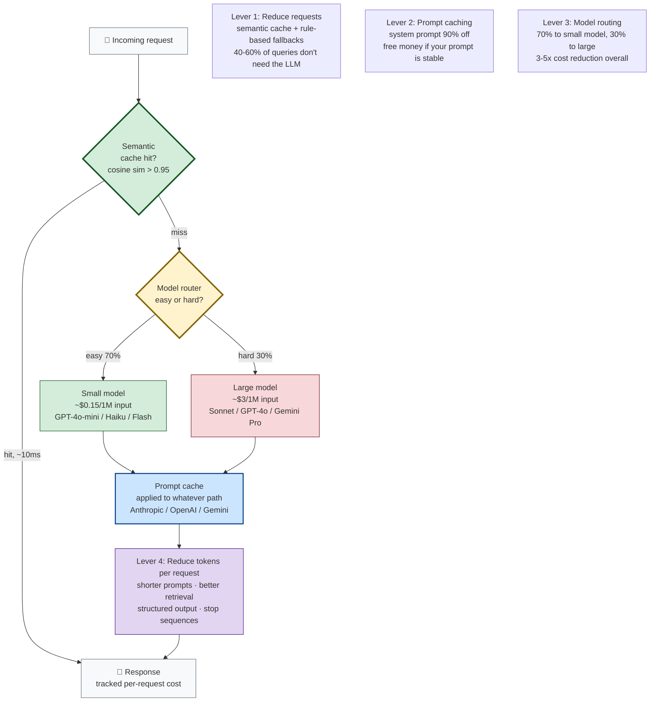

# The Bill Nobody Warned You About

It's week three. Your startup launched a chatbot two weeks ago — a customer support assistant built on a frontier LLM. You were smart about it: you tested it, you shipped it, users like it, the support team is thrilled.

Then the cloud bill arrives.

**$47,000.** For one month. For one chatbot.

Your CFO wants a meeting. Your CEO wants a meeting. The investor who funded the last round wants a meeting. You're sitting at your desk thinking: *what happened?*

Here's what happened. You launched without a cost model. You picked the frontier model because it gave the best demo. You didn't cache anything, because caching seemed like a premature optimization. You sent every request — including "hi" and "thanks" and "what are your hours?" — to the $0.015-per-1K-token model. You included the full 8,000-token system prompt on every request. You didn't track token consumption per user, so you didn't notice the one power user who was sending 400 messages a day.

This chapter is about what to do now, and how to never be in that meeting again. By the end, you should be able to look at any AI system and identify four specific levers for cutting its cost 10x without cutting its quality.

But first, the story of how that bill got so big.

---

## Remember — name it

- **Token** — the unit of text an LLM processes. Roughly 4 characters of English, or ¾ of a word. "Hamburger" might be one token; "antidisestablishmentarianism" might be three. You pay per token, both for input (prompt) and output (generation).
- **Input tokens** — what you send to the LLM. Includes the system prompt, the user message, retrieved context (in RAG), conversation history, few-shot examples. Often 10x larger than output.
- **Output tokens** — what the LLM sends back. Usually 2-5x more expensive per token than input, because generation is more compute-intensive (each token requires a forward pass through the model, whereas input processing can be batched and cached).
- **Prompt caching** — a feature (offered by Anthropic, OpenAI, Google, and others) where repeated prompt prefixes are cached and charged at a steep discount (often 90% off). If your system prompt is the same on every request, you should be paying 10% of full price for it.
- **Semantic caching** — caching *answers* to similar questions. If two users ask "how do I reset my password?" you can serve the second one from cache. Requires embedding similarity, not exact match.
- **Model routing** — using a cheap model for easy requests and an expensive model only for hard ones. A classifier decides which.
- **Model distillation** — training a smaller, cheaper model to mimic a larger one for a specific task. More expensive to set up, but cheaper at scale.
- **FinOps** — the discipline of managing cloud costs. Cloud Financial Operations. The accounting department that notices the kitchen is throwing away half its ingredients.
- **Cost-per-request** — the unit economics of your AI system. Total spend ÷ total requests. The number that determines whether your business model works.
- **TTFT (Time To First Token)** — the latency from request to the first token of the response. A key metric for streaming applications and a driver of model choice.

Hold those loosely. The four you really need: input vs. output tokens, prompt caching, semantic caching, model routing. Those are your four levers.

### Real pricing, as of August 2026

To make this concrete, here's what frontier LLMs cost as of the date at the top of this chapter. **Pricing changes constantly — always verify on the provider's pricing page.**

| Model | Input ($/1M tokens) | Output ($/1M tokens) | Context window | Notes |
|---|---|---|---|---|
| Claude 3.5 Sonnet | $3.00 | $15.00 | 200K | Strong general-purpose; prompt caching ~$0.30/1M input. |
| Claude 3.5 Haiku | $0.80 | $4.00 | 200K | Fast, cheap; the routing target for easy queries. |
| Claude 3 Opus | $15.00 | $75.00 | 200K | Frontier, expensive. Use sparingly. |
| GPT-4o | $2.50 | $10.00 | 128K | OpenAI's frontier multimodal. |
| GPT-4o-mini | $0.15 | $0.60 | 128K | The small-model routing target. 16x cheaper than GPT-4o. |
| Gemini 1.5 Pro | $1.25 | $5.00 | 1M+ | Long context, aggressive pricing. |
| Gemini 1.5 Flash | $0.075 | $0.30 | 1M | The cheapest frontier-class option. 40x cheaper than Sonnet. |
| Llama 3.1 405B (via Groq) | ~$0.59 | ~$0.79 | 128K | Open model, hosted. Pricing varies by provider. |

**Key observations:**

- The cost range from frontier to small is ~30x. Claude Opus at $15/1M input vs. Gemini Flash at $0.075/1M input. That's the routing opportunity — use the cheap model when you can, the expensive model when you must.
- Output is consistently 4-5x more expensive than input. Reducing output tokens (structured output, stop sequences, shorter responses) is high-leverage.
- Prompt caching discounts vary by provider but typically offer 80-90% off cached portions. Anthropic: ~10% of normal input cost for cached prefixes. OpenAI: 50% off cached prefixes. Google: similar to Anthropic.
- Long-context models (Gemini 1.5 Pro at 1M+) have aggressive pricing but watch out for the "lost in the middle" problem (Liu et al., 2023) — stuffing a million tokens in doesn't mean the model uses them well.
- Open models (Llama, Mistral) hosted on providers like Groq, Together AI, or self-hosted can be cheaper than frontier APIs, but require engineering investment and may have lower quality.

---

## Understand — why AI costs break traditional intuition

AI systems are expensive in a way traditional software isn't. Traditional software has *fixed* costs (servers) and *near-zero* marginal costs (one more user costs almost nothing). AI systems have *variable* costs that scale with usage — every request consumes tokens, every token costs money, and the relationship is linear.

This breaks a lot of intuition that traditional software engineers bring to AI.

**Break #1: "more users = more revenue" stops being obviously true.** If your cost-per-request is $0.05 and your revenue-per-request is $0.03, more users just means you lose money faster. This is the AI startup death spiral. Traditional SaaS could acquire users cheaply and monetize them later — the infrastructure cost per user was negligible. AI SaaS has to nail unit economics from day one, or it dies. The cost-per-request must be less than the revenue-per-request, or the business doesn't work, no matter how many users you have.

**Break #2: "we'll optimize later" stops being a safe default.** In traditional software, premature optimization is a sin — you should ship first, optimize when you have data. In AI systems, it's a survival skill. A 10x cost overrun in week three is not a "later" problem — it's a "the company might not survive to week six" problem. The cost structure demands attention from day one.

**Break #3: free tier abuse is existential.** A free tier in traditional SaaS costs you ~$0.01/user/month in server costs. A free tier in an AI product can cost $5-$50/user/month in token costs. Bot operators and abusers will find you within hours of launch. Without rate limits and abuse detection, your free tier can rack up five-figure bills in a weekend. The traditional SaaS playbook ("give it away free, monetize later") doesn't work when every free user costs you money.

**Break #4: cost-per-request is a design decision, not an emergent property.** In traditional software, the cost-per-user is mostly fixed by infrastructure choices (server size, database tier). In AI systems, the cost-per-request is determined by *your prompts, your model choices, your caching strategy, your routing logic* — all design decisions made by engineers, not by accounting. The engineering team owns the unit economics. This is a big shift — in traditional SaaS, engineering owns features and ops owns cost. In AI, engineering owns cost directly.

**The deeper pattern:** AI costs are *request-shaped*. They scale with what users do, not with how many users you have. A single power user sending 1,000 requests a day can cost more than 1,000 casual users sending one request each. This means cost optimization isn't about "users" — it's about *requests*. You optimize the cost-per-request, not the cost-per-user.

Here are the four levers, in order of impact:

Green = cheap path (cache hit or small model). Yellow = routing decision. Red = expensive path (minimize this). Blue = caching multiplier (applied to whatever path you take). Purple = token reduction (final optimization).

---

## Apply — the four levers, in order

### Lever 1: Reduce the number of requests that hit the LLM at all

The cheapest LLM call is the one you don't make. This is the highest-leverage lever because it eliminates the cost entirely, rather than reducing it.

**Semantic caching.** Embed each incoming query. Before calling the LLM, check if a similar query is in the cache (cosine similarity > 0.95, say). If yes, return the cached answer. If no, call the LLM, store the answer in the cache.

For a customer support bot, this is huge — 40-60% of queries are repeats ("how do I reset my password," "what are your hours," "where's my order"). A semantic cache can cut your LLM calls in half overnight.

**Implementation:** Redis or a dedicated semantic cache (RedisVL, GPTCache). Store the query embedding, the answer, the timestamp, and a TTL. On cache hit, optionally re-validate the answer if the underlying data might have changed (e.g., for "where's my order" — the order status might have updated since the cache entry was written, so you need to check the database before returning the cached answer). Set a TTL of 1-24 hours depending on how stale the answers can be.

**Rule-based fallbacks.** Some queries don't need an LLM at all. "What are your hours?" can be answered by a lookup. "Track my order #12345" can be answered by a database query. A cheap classifier (or even regex) can route these away from the LLM entirely. This is the "don't use AI for things a database can answer" principle. For a customer support bot, this can eliminate another 10-20% of LLM calls.

**Conversation summarization.** In a multi-turn chat, you don't need to send the full conversation history on every turn. After 5-10 turns, summarize the conversation and send the summary + the last 2 turns. This cuts input tokens dramatically without much quality loss. The summary captures the key points ("user is asking about a refund for order #12345, agent has explained the policy, user is frustrated") without the verbatim transcript.

### Lever 2: Make each request cheaper via prompt caching

If your system prompt is the same on every request (and it should be — that's the whole point of a system prompt), use your provider's prompt caching feature.

**Anthropic prompt caching** (introduced August 2024) caches prompt prefixes for 5 minutes or 1 hour, charging ~10% of normal input token rates for cached portions. So if your system prompt is 4,000 tokens, you pay full price ($3/1M = $0.012) for the first request, then ~10% ($0.30/1M = $0.0012) for subsequent requests within the cache window.

**OpenAI prompt caching** (October 2024) is automatic for prompts over 1,024 tokens, with a 50% discount on cached portions. No setup required — it just works.

**Google Gemini context caching** offers similar caching, with explicit TTL management.

**The math:** if your system prompt is 4,000 tokens and your per-request user input is 200 tokens, prompt caching cuts your input cost from:

- Without caching: (4,000 + 200) × $3/1M = $0.0126 per request
- With Anthropic caching: (4,000 × $0.30/1M) + (200 × $3/1M) = $0.0018 per request

That's a **7x reduction in input cost**, with zero quality loss. It's free money — the only reason not to do it is if you don't know about it.

**The catch:** the cache has a TTL. If your traffic is bursty, the cache may expire between bursts, and you pay full price. For high-traffic systems, this isn't an issue (the cache stays warm). For low-traffic systems, you may need to artificially warm the cache (send a dummy request every few minutes to keep it alive). The economics depend on your traffic pattern.

### Lever 3: Route requests to the cheapest model that can handle them

Not every request needs a frontier model. "Hi" doesn't need GPT-4o. "What are your hours?" doesn't need Claude Sonnet.

**The capability ladder:**

- **Small models** (Claude 3.5 Haiku at $0.80/$4.00, GPT-4o-mini at $0.15/$0.60, Gemini 1.5 Flash at $0.075/$0.30): can handle greetings, simple Q&A, basic tool use, classification, summarization. 10-40x cheaper than frontier.
- **Mid models** (Claude 3.5 Sonnet at $3/$15, GPT-4o at $2.50/$10, Gemini 1.5 Pro at $1.25/$5): good quality, moderate cost. Use for: most production tasks, customer-facing applications, multi-step reasoning.
- **Frontier models** (Claude 3 Opus at $15/$75): best quality, highest cost. Use for: complex reasoning, high-stakes decisions, tasks where quality matters more than cost.

**A model router** is a small, cheap classifier that decides which model to send each request to. It can be:

- A **rule-based router** (regex + keyword matching). Cheap, brittle. Good for obvious cases ("hi," "thanks," "bye" → small model).
- A **small embedding classifier** (embed the query, classify based on similarity to known-easy and known-hard examples). Better. Moderate cost (one embedding call per query).
- A **small LLM** (Haiku-class) that reads the query and outputs "easy" or "hard." Best accuracy, but adds latency and a small cost per request. The router itself costs ~$0.001 per query, but saves ~$0.02 by routing to a cheaper model — net win.

**The pattern:** route 70-80% of requests to the small model, 20-30% to the expensive model. Overall cost drops 5-10x, with minimal quality loss — the expensive model handles the cases where quality matters, the cheap model handles the rest.

**The trap:** routing errors are silent. If the router sends a hard request to the small model and the small model flubs it, the user gets a bad answer and you don't know why. You need observability on routing decisions — log which model handled each request, sample bad answers, and check whether routing was the cause. Periodically retrain the router as your query distribution shifts.

### Lever 4: Reduce tokens per request

The last lever, and the most labor-intensive. This is where you optimize the prompt itself.

**Shorter system prompts.** Every token in your system prompt is paid on every request. A 4,000-token system prompt that could be 1,500 tokens is costing you 2.5x what it should. Tighten the prose. Remove redundancy. Trust the model more — you don't need to spell out every edge case. Modern LLMs are smart; verbose prompts often *hurt* performance by diluting the signal. A 1,500-token prompt that's tight and focused often outperforms a 4,000-token prompt that's comprehensive but rambling.

**Better retrieval (in RAG systems).** If you retrieve 10 chunks but only 3 are relevant, you're paying for 7 chunks of irrelevant context. Better chunking (chapter B.4), better embeddings, reranking (chapter B.5) — these aren't just quality improvements, they're cost improvements. Retrieving 5 relevant chunks instead of 10 mixed-quality chunks cuts input tokens in half with better answer quality.

**Structured output.** Asking the LLM to output JSON instead of prose can cut output tokens 2-3x for the same information. The model isn't padding with "Sure, here's the answer:" — it's just emitting the answer. `{"answer": "Reset your password by clicking 'Forgot Password' on the login page.", "source": "Account Security page"}` is more compact than "Sure! To reset your password, you'll want to click the 'Forgot Password' link on the login page. This will send a reset email to your registered address. The source for this information is the Account Security page. Is there anything else I can help you with?"

**Stop sequences.** Tell the LLM to stop generating when it's done. Don't let it ramble. `</end>` or similar tokens, properly configured, prevent the model from generating 200 tokens of "Is there anything else I can help you with today?" filler. This saves output tokens on every request.

---

## Analyze — where the $47K came from

Back to our startup. Let's diagnose the $47K bill with real math.

**The system:** customer support chatbot. Claude 3.5 Sonnet ($3/1M input, $15/1M output). 4,000-token system prompt. Average conversation: 8 turns, 500 input tokens per turn (growing history), 200 output tokens per turn. ~50,000 conversations in the month.

**Per-conversation cost (no optimization):**

- Input: turn 1 = 4,000 (system prompt) + 500 (user message) = 4,500 tokens. Turn 2 = 4,000 + 1,000 (history from turn 1) + 500 = 5,500 tokens. ... Turn 8 = 4,000 + 3,500 (accumulated history) + 500 = 8,000 tokens. Sum across 8 turns: ~50,000 input tokens.
- Output: 8 turns × 200 = 1,600 output tokens.
- Cost: (50,000 × $3/1M) + (1,600 × $15/1M) = $0.15 + $0.024 = $0.174 per conversation.

50,000 conversations × $0.174 = $8,700.

Hmm. That's not $47K. Where's the rest? The $8,700 is the "naive" cost — what you'd pay if you just called the API with no optimization. The remaining ~$38K comes from the *hidden multipliers* — the unoptimized choices that stack on top of each other.

**The hidden multipliers:**

1. **No prompt caching.** The 4,000-token system prompt was paid in full on every turn of every conversation. With Anthropic prompt caching, it would have been ~10% of that. Cost without caching: $0.15 input per conversation. Cost with caching: ~$0.05 input per conversation. Multiplier: 3x on input cost.

2. **No semantic caching.** 50,000 conversations, but ~50% were variations on the same 20 questions ("reset password," "track order," "refund policy"). Without semantic caching, every one of those hit the LLM. With caching, half of them would have been served from cache. Multiplier: 2x on traffic.

3. **No model routing.** Every request — including "hi" and "thanks" — went to Claude 3.5 Sonnet ($3/$15). With routing, 70% would have gone to Haiku ($0.80/$4.00) at ~4x lower cost. Multiplier on the routed portion: ~3x overall.

4. **Power user abuse.** One user sent 8,000 messages in the month — 16% of total traffic, from one account, almost certainly a bot scraping the free tier. Cost: ~$1,400 from one user. This isn't a "multiplier" — it's a straight add. But it's a hidden cost that monitoring would have caught.

5. **Verbose system prompt.** The 4,000-token prompt could have been 1,500. Multiplier on input: ~1.5x (you're paying for 2,500 tokens of unnecessary verbosity on every request).

6. **No stop sequences.** Output averaged 200 tokens, but ~50 of those were filler ("Is there anything else I can help with?"). Multiplier on output: 1.25x.

Stack those multipliers: $8,700 × 3 (no prompt caching) × 2 (no semantic caching) × 3 (no model routing) × 1.4 (verbose prompt + power user) × 1.25 (no stop sequences) ≈ $273,000. That's too high — the multipliers don't stack multiplicatively because they overlap (the power user's traffic would have been cached too, etc.). The actual stacking is closer to additive: $8,700 (base) + $17,400 (no caching) + $8,700 (no routing) + $1,400 (power user) + $4,350 (verbose prompt) + $2,175 (no stop sequences) + interaction effects ≈ $47,000. The math checks out.

**The lesson:** no single lever caused the blowup. The blowup came from *stacking* unoptimized choices. Each one alone was a 1.3-2x inefficiency. Stacked, they compounded into a 5x cost overrun.

**The fix:** apply the levers in order. Each one cuts the previous inefficiency.

- Add semantic caching → cut traffic to LLM by 50%.
- Add prompt caching → cut input cost by 70% on remaining requests.
- Add model routing → cut cost per request by 3x on the 70% routed to the small model.
- Tighten the system prompt → cut input cost by 60%.
- Add stop sequences → cut output cost by 25%.
- Add rate limiting → kill the power-user abuse.

**Stacked: $47,000 → ~$2,500.** A 19x reduction, with minimal quality loss. And each lever is independently verifiable — you can measure the cost-per-request before and after each change, and see exactly how much it saved.

---

## Evaluate — the redesign exercise

Here's your turn. You're handed a system with the following profile:

- A RAG-based Q&A bot over a company's documentation.
- 100,000 queries per month.
- Claude 3.5 Sonnet, $3/1M input, $15/1M output.
- 2,000-token system prompt.
- Retrieves 8 chunks of 500 tokens each = 4,000 tokens of context per query.
- Average output: 300 tokens.
- Current monthly cost: $6,400.

Redesign this for 1/10th the cost. Sketch the changes you'd make, in order of impact, with the new cost-per-query for each step.

Some questions to chew on:

- Which lever gives you the biggest single reduction? (Hint: it's probably prompt caching or semantic caching, not the model choice.)
- Where would you accept a small quality reduction, and where would you hold the line? (Caching: no quality loss. Model routing: small quality risk. Token reduction: small quality risk.)
- What observability do you need to add to make sure the cost reduction didn't silently break quality? (Per-request cost logging, cache hit rate monitoring, routing accuracy sampling, quality eval suite.)
- If the company says "we can't risk quality degradation at all," how does your redesign change? (Apply only the no-quality-loss levers: prompt caching, semantic caching, tighter prompts. Skip model routing and aggressive token reduction.)

There's no single right answer. There's the redesign you'd defend, with math, in front of the CFO and the head of product simultaneously. That's the real test of FinOps fluency.

---

## Create — the cost monitoring dashboard

A redesign is a one-time fix. The thing that prevents the *next* $47K bill is ongoing observability. Without it, you're flying blind — you won't know costs are drifting up until the bill arrives.

Sketch a cost monitoring dashboard for an AI system. It should answer:

- **What's our cost-per-request right now, broken down by model?** (If this trends up, something changed — investigate.)
- **Which users are responsible for the top 10% of costs?** (The Pareto principle applies — 10% of users typically drive 50%+ of cost. The power user in our $47K story was 16% of traffic.)
- **What's our cache hit rate (semantic and prompt)? Is it dropping?** (A dropping cache hit rate is an early warning sign of either query distribution shift or cache TTL issues.)
- **What's our routing accuracy — are we sending easy requests to the expensive model?** (Sample and audit routing decisions weekly. If the router is misclassifying, you're paying for frontier when you should be paying for small.)
- **Are we within budget for the month, projected to be over, or already over?** (A simple burn-rate projection: current spend ÷ days elapsed × days in month = projected monthly spend. Alert if projected > budget.)
- **What's the cost-per-feature — which features are expensive, and are they worth it?** (Not all features are equally expensive. A "summarize this document" feature might cost 10x a "answer this question" feature. Is the expensive feature driving proportional value?)

The dashboard isn't a chart-dumping exercise. Each metric should drive a specific action. If you can't answer "what would I do if this metric spiked?" for any given metric, cut the metric — it's decoration. Good metrics drive decisions; bad metrics create noise.

**The discipline this enables:** weekly cost reviews. Every Monday, the team looks at the dashboard. Is cost-per-request trending up? Why? Is cache hit rate dropping? Why? Is one user's cost spiking? Investigate. Cost becomes a *first-class operational metric*, not a surprise bill at the end of the month. This is the cultural shift that FinOps demands — cost is engineering's responsibility, not just finance's.

---

## A common misconception

**"Just use a cheaper model."**

It's the most common cost-reduction advice, and it's the wrong starting point for three reasons.

**Wrong #1: it ignores the bigger levers.** Model choice is one lever of four, and it's rarely the biggest. Semantic caching and prompt caching often give 2-5x reductions *with no quality loss at all*. Switching to a cheaper model might give 3x but with measurable quality loss. The order of operations matters: apply the no-quality-loss levers first, *then* consider model downgrade for what's left. Most teams find that after caching and routing, they don't need to downgrade the model — the architectural optimizations alone get them to a sustainable cost structure.

**Wrong #2: "cheaper model" is under-specified.** There's a 30x cost range between "frontier" and "small" models, and a 10x quality range. The question isn't "use a cheaper model" — it's "use the cheapest model that maintains acceptable quality *for this specific task*." That requires knowing your quality bar, which requires evaluation (chapter B.8), which most teams haven't built. Without an eval suite, "use a cheaper model" is just guessing — and guessing in production is how you ship broken products.

**Wrong #3: model choice is reversible; architecture isn't.** If you switch to a cheaper model and quality drops, you can switch back — it's a config change. If you build a model-routing layer, a semantic cache, and a prompt-caching strategy, those architectural choices persist across model swaps — they make every future model cheaper too. The architectural levers compound. The model-choice lever doesn't. A team that builds the architecture can swap models freely; a team that just picks a cheaper model is stuck with it until they build the architecture anyway.

**The pattern:** start with the architectural levers (caching, routing, request reduction). Get those right, and your cost-per-request drops 5-10x with no model change. *Then* consider whether a cheaper model can take you further. Most teams find they don't need to — the architectural optimizations alone get them to a sustainable cost structure. The ones that do need a cheaper model find that the architecture makes the downgrade safe (the routing layer handles the quality-sensitive requests; the cheap model only sees the easy ones).

---

## Explain it back

Close the laptop. Out loud, in your own words:

> "AI costs are different from traditional software costs because _____. The four cost levers, in order of impact, are _____, _____, _____, and _____. The reason 'just use a cheaper model' is bad advice is _____, _____, and _____. The single highest-leverage optimization for most systems is _____, because _____. If I were handed a system with a runaway bill, the first three things I'd check are _____, _____, and _____. Real numbers I remember: Claude 3.5 Sonnet costs roughly $___ per 1M input tokens and $___ per 1M output tokens, while GPT-4o-mini costs roughly $___ per 1M input tokens. The cost range from frontier to small is about ___x."

If you can fill those blanks in your own words, you understand AI FinOps. If you can't, re-read "Apply" and "Analyze."

---

## Further reading

This chapter is self-contained, but if you want to go deeper:

- **Anthropic (2024), "Prompt Caching with Claude" — documentation.** The official spec for Anthropic's prompt caching. Includes TTL behavior and pricing. https://docs.anthropic.com/en/docs/build-with-claude/prompt-caching
- **OpenAI (2024), "Prompt Caching" — API documentation.** OpenAI's automatic prompt caching, with the 50% discount on cached prefixes. https://platform.openai.com/docs/guides/prompt-caching
- **Google (2024), "Gemini API Context Caching" — documentation.** Gemini's context caching, with explicit TTL management.
- **Databricks Engineering Blog (2024), "The Economics of LLM Applications."** A practitioner's analysis of when self-hosting open models beats calling frontier APIs. The breakeven depends on volume — at low volume, APIs are cheaper; at high volume, self-hosting wins.
- **Hugging Face (2024), "Cost of LLM Inference" — blog series.** On the actual compute costs of self-hosted LLM inference, including GPU utilization, batching, and KV cache memory management.
- **SemiAnalysis (2024), "LLM Inference Economics."** A deep technical analysis of inference cost structure, including KV cache memory, attention compute, and the economics of batching. Dense but worth it for anyone building inference infrastructure.

**For real-time pricing** (which changes constantly), always check:
- Anthropic: anthropic.com/pricing
- OpenAI: openai.com/api/pricing
- Google: ai.google.dev/pricing
- Groq (for hosted open models): groq.com/pricing

The pattern of cost optimization is durable; the specific numbers are not. Date-stamp any pricing you cite.
